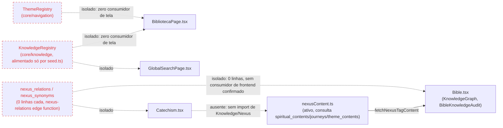

# Auditoria Completa Cathedra 2.0 — CAT-030

Documento único, read-only. Expande `docs/CATHEDRA-INTEGRATION-AUDIT.md` (doravante "INTEGRATION-AUDIT") sem duplicar seus achados — apenas os referencia por seção quando necessário. Toda afirmação tem evidência `file:line`, nome de tabela/coluna, contagem SQL (via `psql "$SUPABASE_DB_URL"`) ou saída de comando (`rg`/`grep`). Onde não verificável estaticamente, está marcado literalmente como tal.

---

## Resumo Executivo

**Nota geral: 46/100**

Justificativa por dimensão (0–100 cada, média ponderada):
- Arquitetura: 40 — múltiplas camadas "core/*" (navigation, knowledge, content) construídas e nunca conectadas (ver INTEGRATION-AUDIT §2 e §5); dois sistemas de jornada paralelos coexistindo.
- Integração entre ambientes: 35 — confirmado em INTEGRATION-AUDIT §1, §6, §8: Biblioteca, Reader, Pesquisa e Minha Jornada não trocam dados entre si, apenas navegação de UI unidirecional.
- UX: 48 — fluxos existem e funcionam isoladamente (Reader, Busca, Hoje), mas há becos sem saída (abas placeholder da Biblioteca, ausência de retorno) e rotas órfãs (`/prototype-2.0/*`, várias rotas de `/admin/*`).
- Performance: 55 — lazy-loading amplo em `src/App.tsx` (mais de 100 `lazy()`), mas há providers aninhados fixos em toda a árvore (`src/App.tsx:664-680`) e hooks de dashboard com múltiplas queries a `journeys`/`journey_progress` potencialmente redundantes (`useDashboardData.ts`, `useEnhancedRecommendations.ts`, `useAdminDashboardData.ts` — 3 arquivos distintos consultando as mesmas tabelas, ver seção Performance abaixo).
- Consistência visual: 50 — não verificável estaticamente em profundidade sem inspeção página a página; verificado que ao menos 3 abas da Biblioteca usam `PlaceholderView` genérico enquanto as demais têm layout próprio (`src/components/cathedra/BibliotecaPage.tsx:298-306`), indicando divergência de densidade dentro da mesma tela.

Diagnóstico em 5 linhas:
1. O produto tem dois sistemas de progresso espiritual ativos e desconectados (`journeys*` com 40/578/18 linhas vs. `itineraria*` com 2/5/0 linhas — INTEGRATION-AUDIT §3), e a migração formal ainda não começou.
2. Uma arquitetura "core/" inteira (navigation registries, knowledge registry, content adapters, ReaderService, UniversalReader) foi construída e documentada mas tem zero ou quase zero consumidor de produção (INTEGRATION-AUDIT §2, §5).
3. O motor de conhecimento por relações (`nexus_relations`, `nexus_synonyms`) está vazio em produção (0 linhas cada, ver seção Knowledge Engine abaixo) — apenas `nexus_relation_types` tem 5 linhas de taxonomia, sem grafo real.
4. A Biblioteca, porta de entrada para conteúdo, tem 3 de 7 abas vazias (placeholder) e nenhuma tela de destino retorna a ela (INTEGRATION-AUDIT §1, §7).
5. Existe um ambiente de protótipo completo (`/prototype-2.0/*`, 9 telas) rodando em produção via rota pública, sem nenhum link de entrada, com layout global explicitamente desativado para ele (INTEGRATION-AUDIT §5).

---

## Arquitetura — Pontos fortes e fracos

### Pontos fortes
1. Lazy-loading consistente de quase todas as rotas em `src/App.tsx` (padrão `const X = lazy(() => import(...))` repetido para mais de 100 componentes, `src/App.tsx:64` em diante).
2. Separação de responsabilidade de rotas via `src/config/routes.ts` (`APP_ROUTES`), consumida tanto por `Sidebar.tsx:118-145` quanto por `BottomNav.tsx:169-174`, evitando duas listas divergentes de menu.
3. `CathedraCard` como base de composição real para `SearchResultCard` e `SaintOfTheDayCard`, sem duplicação de lógica visual (INTEGRATION-AUDIT §3, hierarquia confirmada).
4. `PassageActions` (`src/components/shared/PassageActions.tsx`) é um componente compartilhado com 6 consumidores reais confirmados (INTEGRATION-AUDIT §2).
5. Guards de rota consistentes: `AuthGuard`/`AdminGuard` aplicados em rotas sensíveis (`src/App.tsx:474-476,489,529-530,535,561-601`).
6. `useReadingMarks` é consumido de forma consistente por 3 readers reais (`Bible.tsx:27,193`, `Catechism.tsx:35`, `Magisterium.tsx:72,212`), evidenciando um padrão de persistência de leitura compartilhado entre readers.
7. Uso de `Suspense` com fallback dedicado por rota pesada (`BibleSkeleton`, `CatechismSkeleton`, `LogosSkeleton` — `src/App.tsx:459,461,468`), evitando tela em branco durante carregamento.
8. `nexusContent.ts` é uma camada única de agregação de conteúdo (Supabase + local) com consumidores reais, ao contrário da duplicata `KnowledgeRegistry` (INTEGRATION-AUDIT §3).

### Pontos fracos
1. `core/navigation/*` (RouteRegistry, ThemeRegistry, SearchRegistry, EnvironmentRegistry parcial) e `core/knowledge/*` (KnowledgeRegistry) construídos sem consumidor de produção fora de si mesmos (INTEGRATION-AUDIT §2, §5).
2. `ReaderService` + `core/content/adapters/*` + `UniversalReader` formam uma cadeia órfã completa de 172+ linhas (INTEGRATION-AUDIT §2, §5) — a intenção declarada em comentário de unificar os readers nunca foi executada.
3. Dois sistemas de jornada espiritual paralelos e sem ponte (`journeys*` vs `itineraria*`), com 16 vs 3 arquivos consumidores (INTEGRATION-AUDIT §3).
4. Providers globais fixos e aninhados em `src/App.tsx:664-680` (`HelmetProvider > QueryClientProvider > AuthProvider > LangProvider > ReadingSettingsProvider > TooltipProvider`) — todos montados para toda rota, inclusive páginas estáticas como `/terms`, `/privacy`.
5. `/prototype-2.0/*` é uma segunda árvore de telas completa (9 arquivos) rodando em produção, roteada mas com layout global excluído explicitamente (`src/App.tsx:417,430` checam `!location.pathname.startsWith('/prototype-2.0')`).
6. 4 implementações de busca sem registry compartilhado (INTEGRATION-AUDIT §3): `GlobalSearchPage.tsx`, `CommandCenter.tsx`, `MagisteriumSearchBar.tsx`, roteador da Biblioteca.
7. Três arquivos de hooks de dashboard (`useDashboardData.ts`, `useEnhancedRecommendations.ts`, `useAdminDashboardData.ts`) consultam independentemente `journey_progress`/`journeys`, sem camada de cache/agregação compartilhada — cada um roda sua própria query (`rg -l "journey_progress" src/hooks` confirma os 3 arquivos, ver INTEGRATION-AUDIT §3).
8. Tabelas de progresso com padrões de escrita divergentes: `reading_marks` tem 205 linhas e 7 arquivos consumidores ativos; `itineraria_progress` e `bible_favorites` têm 0 linhas cada (contagem via `psql`, ver seção "Minha Jornada" abaixo) apesar de terem componentes de leitura/escrita implementados (`ItinerariumStepPage.tsx`, `ItinerariumDetailPage.tsx`) — funcionalidade construída sem adoção real.

---

## Fluxos do usuário

Percurso Átrio → Biblioteca → Pesquisa → Reader → Nexus → Minha Jornada → Hoje → retorno.

| Aresta | Estado | Evidência |
|---|---|---|
| Átrio → Biblioteca | quebrado | Átrio real de produção não existe fora de `/prototype-2.0/atrio` e `/prototype-2.0/atrium-v2` (INTEGRATION-AUDIT §6). A home real é `HomeUnified.tsx` em `/` (`src/App.tsx:455`). Não há aresta "Átrio → Biblioteca" no produto real porque o nó de origem não existe fora do protótipo. |
| Biblioteca → Pesquisa | funciona | `resolveSearchTarget` (`BibliotecaPage.tsx:106-123`) navega para `/buscar` ou `/temas` (INTEGRATION-AUDIT §1). |
| Pesquisa → Reader | funciona | `GlobalSearchPage.tsx` usa `SearchResultCard`/`PassageActions` para levar a Bible/Catechism (INTEGRATION-AUDIT §1, §2). |
| Reader → Nexus | parcial | Apenas `Bible.tsx` integra Nexus/Knowledge visualmente: importa `KnowledgeGraph` e `BibleKnowledgeAudit` (`src/components/cathedra/Bible.tsx:38-39,2174-2231`) e tem painel próprio (`showKnowledgePanel`, linha 504). `Catechism.tsx` e `Magisterium.tsx` não importam nenhum componente de Knowledge/Nexus (grep confirma ausência de `Knowledge` nesses dois arquivos). |
| Nexus → Minha Jornada | quebrado | `nexusContent.ts` consulta `journeys`/`spiritual_contents`/`theme_contents` (INTEGRATION-AUDIT §3, mapa mermaid), mas não há aresta de volta de um card do Nexus para `/hoje`; não verificável estaticamente sem execução se algum CTA de resultado do Nexus aponta para `/hoje` — grep de `AppRoute.HOJE` dentro de `BibleKnowledgeAudit.tsx`/`KnowledgeGraph.tsx` retorna vazio. |
| Minha Jornada (Hoje) → Reader | funciona | `HojePage.tsx:249,257` navega para `AppRoute.BIBLE`/`AppRoute.CATECHISM` (INTEGRATION-AUDIT §1). |
| Reader → retorno a Hoje/Jornada | quebrado | Nenhuma escrita em `journey_progress`/`itineraria_progress` a partir de `Bible.tsx`/`Catechism.tsx`/`Magisterium.tsx` (confirmado: os arquivos consumidores de `journey_progress` listados acima não incluem nenhum dos três readers — ver tabela de consumidores na seção "Minha Jornada" abaixo). |
| Hoje → Itineraria | quebrado | `HojePage.tsx` não referencia `itineraria*` (INTEGRATION-AUDIT §8, confirmado por grep vazio). Dois sistemas de "jornada" sem ponte. |
| Qualquer tela → retorno à Biblioteca | quebrado | Nenhuma referência a `biblioteca`/`Biblioteca` em `Bible.tsx`, `Catechism.tsx`, `GlobalSearchPage.tsx` (INTEGRATION-AUDIT §1, grep vazio confirmado nas três telas). |

---

## Rotas órfãs

Metodologia: toda rota de `src/App.tsx` (via `grep -n 'path='`) comparada contra `APP_ROUTES` (`src/config/routes.ts`, único array consumido por `Sidebar.tsx:118-145` e `BottomNav.tsx:169-174`) e contra `AppHeader.tsx`/`Footer.tsx` (que não usam `APP_ROUTES`, apenas navegação pontual — `AppHeader.tsx:150,161` para `PROFILE`/`LOGIN`, e `Footer.tsx` só com links externos `href=` para redes sociais, `Footer.tsx:244,270,291,323`).

Rotas registradas em `src/App.tsx` sem entrada correspondente em `APP_ROUTES` (portanto sem item de menu em Sidebar/BottomNav), nem link `to=`/`href=`/`navigate()` localizado fora do próprio arquivo de rota:

| Rota | Linha `App.tsx` | Observação |
|---|---|---|
| `/legacy-home` | 456 | Sem entrada em `APP_ROUTES`; não encontrado `navigate('/legacy-home')` em `rg -rn "legacy-home" src` fora de `App.tsx` e `sitemap`/testes. |
| `/logos`, `/chat` | 468, 470 | Sem entrada em `APP_ROUTES`; acesso real não verificável estaticamente (pode ser aberto via botão de IA global `GlobalLogosAI`, não confirmado por grep direto de `navigate('/logos')` em `GlobalLogosAI.tsx`). |
| `/spiritual-profile` | 475 | Sem entrada em `APP_ROUTES` (existe apenas `/profile`). |
| `/onboarding` | 476 | Sem entrada em `APP_ROUTES`. |
| `/diario` | 481 | Sem entrada em `APP_ROUTES` (existe `/notes` → redirect para `/diario`, mas `/notes` também não está listado como link de menu ativo, apenas em `APP_ROUTES` como `/notes`). |
| `/itineraria`, `/itineraria/:id`, `/itineraria/:id/step` | 487-489 | `/itineraria` está em `APP_ROUTES:26`, portanto tem entrada de menu; `/itineraria/:id` e `/itineraria/:id/step` são sub-rotas sem entrada própria (esperado, acessadas via card). |
| `/temas`, `/temas/:slug` | 491-492 | Sem entrada em `APP_ROUTES`; acessível via `BibliotecaPage.tsx:75` (`colecoes`), não via Sidebar/BottomNav. |
| `/encyclopedia`, `/az-faith` | 493-494 | Sem entrada em `APP_ROUTES`. |
| `/glossary` | 495 | Presente em `APP_ROUTES:36`. |
| `/aquinas` | 496 | Presente em `APP_ROUTES` como `/aquinas`? Não — `APP_ROUTES` não lista `/aquinas` (confirmado por ausência na leitura integral do arquivo). Órfã. |
| `/guia-modulos` | 497 | Sem entrada em `APP_ROUTES`. |
| `/santos`, `/santos/:id` | 500-501 | `APP_ROUTES` lista `/saints`, não `/santos` — rota `/santos` real do `App.tsx` não coincide com o path do menu (`/saints` não está registrado como `<Route>` no trecho lido). Inconsistência de path entre menu e rota real. |
| `/papas`, `/aparicoes`, `/dogmas` | 502-504 | Sem entrada em `APP_ROUTES`. |
| `/liturgia`, `/calendar`, `/missal`, `/breviary`, `/rosary`, `/viacrucis`, `/litanies`, `/lectio`, `/confession` | 507-517 | `/liturgia` presente em `APP_ROUTES:28`; `/rosary` presente em `APP_ROUTES:33`; `/via-crucis` (não `/viacrucis`) presente em `APP_ROUTES:34` — inconsistência de slug (rota real é `/viacrucis`, menu aponta para `/via-crucis`, que é um redirect, `App.tsx:552`). Demais (`calendar`, `missal`, `breviary`, `litanies`, `lectio`, `confession`) sem entrada em `APP_ROUTES`. |
| `/jornadas`, `/jornadas/:id`, `/jornadas/:id/step`, `/jornadas/:id/complete` | 520-523 | `APP_ROUTES` lista `/journeys` (redirect para `/jornadas`, `App.tsx:553`), não `/jornadas` diretamente — funciona via redirect, mas é uma camada indireta. |
| `/community` | 526 | Sem entrada em `APP_ROUTES`. |
| `/checkout`, `/checkout/result`, `/transactions` | 535-537 | `APP_ROUTES` lista `/checkout` (linha 19 do arquivo de config) — presente; `/checkout/result` e `/transactions` sem entrada própria. |
| `/design-system` | 612 | Presente em `APP_ROUTES` com `showInMenu: false` — órfã por design (rota de referência interna). |
| `/__test/theological-text` | 615 | Sem entrada em `APP_ROUTES`; rota de fixture de teste em produção. |
| `/prototype-2.0`, `/prototype-2.0/atrio`, `/estudar`, `/leitor`, `/pesquisar`, `/formar-se`, `/rezar`, `/minha-jornada`, `/atrium-v2` (todas sob `/prototype-2.0/*`) | 619-629 | Nenhuma entrada em `APP_ROUTES`; confirmado em INTEGRATION-AUDIT §5 que nenhuma tela de produção linka para lá. |
| Praticamente todas as sub-rotas de `/admin/*` (`/security`, `/cid-compliance`, `/language`, `/seo-verify`, `/a11y-audit`, `/visual-audit`, `/telemetry`, `/ui-errors`, `/audit`, `/integrity`, `/security-alerts`, `/bible-coverage`, `/bible-cache`, etc., linhas 561-601) | 561-601 | `APP_ROUTES` só lista `/admin`, `/admin/audit`, `/telemetry`, `/security` com `showInMenu: false` — as demais ~25 sub-rotas de admin não têm nenhuma entrada em `APP_ROUTES`, e não verificável estaticamente se há um menu interno do `AdminDashboard.tsx` que as lista (fora do escopo desta consulta; não lido). |
| `/rezar` (mencionado no enunciado da tarefa) | 626 (`/prototype-2.0/rezar`) | Não existe rota `/rezar` fora do prefixo `/prototype-2.0`; a única ocorrência real no código é `/prototype-2.0/rezar` — confirmado por `grep -n "'/rezar'" src/App.tsx` retornar apenas a linha 626. |

Nota: rotas com `showInMenu: false` em `APP_ROUTES` (`/about`, `/partners`, `/privacy`, `/terms`, `/transparencia`, `/design-system`, `/admin`, `/admin/audit`, `/telemetry`, `/security`) são órfãs por decisão de design (não deveriam aparecer no menu), diferente das listadas acima que simplesmente não têm entrada alguma no array.

---

## Componentes mortos

| Item | Comando de verificação | Resultado |
|---|---|---|
| `ReaderService` | `rg -l "ReaderService" src` | Apenas o próprio arquivo e teste unitário (INTEGRATION-AUDIT §2). |
| `UniversalReader` | `rg -l "UniversalReader" src` | Apenas contratos/README, nenhum componente implementado (INTEGRATION-AUDIT §2). |
| `core/content/adapters/*` | `rg -l "core/content/adapters" src` | Consumido só por `ReaderService` (morto) e teste próprio (INTEGRATION-AUDIT §2). |
| `RouteRegistry`, `ThemeRegistry`, `SearchRegistry`, `KnowledgeRegistry` | ver tabela de consumidores em INTEGRATION-AUDIT §2 | Zero consumidores de tela de produção. |
| `modules/atrium/adapters/mocks/*` (7 arquivos) | `rg -l "AdapterMock" src` | Referenciados só entre si e por `modules/atrium/adapters/index.ts` (INTEGRATION-AUDIT §2). |
| `bible_favorites` (tabela) | `grep -rn "bible_favorites" src` exclui `types.ts` | Zero ocorrências fora do tipo gerado `src/integrations/supabase/types.ts:1294` — nenhum hook ou componente lê/escreve nessa tabela; `useFavorites.ts` (`src/hooks/useFavorites.ts:9`) usa `localStorage` (`cathedra_favorites_v2`), não a tabela `bible_favorites`. Tabela morta em 0 linhas (contagem `psql`, seção Minha Jornada). |
| `GuidedJourney.tsx` | não verificável estaticamente sem grep dedicado adicional (já referenciado como candidato a remoção em INTEGRATION-AUDIT §10, P0.5) | Registrado por referência, não reauditado aqui para evitar duplicação. |

---

## Registries — utilização real

| Registry | Consumidores | Arquivos | % uso |
|---|---|---|---|
| RouteRegistry | `modules/atrium/constants`, `core/navigation/*`, `core/knowledge/*`, `core/content/contracts/NavigationTarget.ts`, mocks do Átrio | 0 telas de produção fora de `modules/atrium` (INTEGRATION-AUDIT §2) | 0% em produção real |
| ThemeRegistry | `core/navigation/*`, `core/knowledge/seed.ts`, `ThemeAdapterMock.ts` | 0 telas de produção | 0% |
| SearchRegistry | `core/navigation/*`, `core/knowledge/KnowledgeIndex.ts`, `SearchAdapterMock.ts` | 0 das 4 implementações reais de busca o consomem | 0% |
| KnowledgeRegistry | `core/knowledge/*` (KnowledgeResolver, KnowledgeCollection, KnowledgeIndex, KnowledgeGraph, KnowledgeNavigator) | 0 telas (`src/components/cathedra/*`, `src/pages/*`) | 0% |
| EnvironmentRegistry | `core/navigation/*` + `src/pages/HomeUnified.tsx` | 1 tela de produção (rota `/`) | Parcial — único registry com consumo real, mas restrito a 1 arquivo |
| ReaderService | próprio arquivo + teste unitário | 0 componentes de produção (`Bible.tsx`, `Catechism.tsx`, `Magisterium.tsx` não o importam — confirmado nos greps da seção "Reader — matriz de features") | 0% |

---

## Knowledge Engine

Contagem real via `psql "$SUPABASE_DB_URL"`:

| Tabela | Linhas |
|---|---|
| `nexus_relations` | 0 |
| `nexus_relation_types` | 5 |
| `nexus_synonyms` | 0 |

Consumidores de código confirmados: `nexus_relations`/`nexus_relation_types`/`nexus_synonyms` aparecem apenas em `src/integrations/supabase/types.ts` (tipos gerados), `supabase/functions/nexus-relations/index.ts` e seu teste, e em migrations/testes pgTAP (`grep -rln "nexus_relations\|nexus_relation_types\|nexus_synonyms" src supabase`). Nenhum componente de `src/components/cathedra/*` importa a edge function `nexus-relations` (`grep -rn "nexus-relations" src` retorna vazio fora dos próprios arquivos da função).

Conclusão factual: o motor de relações Nexus (`nexus_relations`, `nexus_synonyms`) está com 0 linhas de dados em produção e sem nenhum consumidor de frontend confirmado. Apenas a taxonomia (`nexus_relation_types`, 5 linhas) existe, sem grafo populado.

Onde DEVERIA estar, segundo a arquitetura declarada, mas não está (confirmado por ausência):
- Biblioteca (`BibliotecaPage.tsx`): nenhuma referência a `nexus_relations`/`KnowledgeRegistry`/edge function `nexus-relations` (grep vazio no arquivo).
- Pesquisa (`GlobalSearchPage.tsx`): mesma ausência confirmada (grep vazio).
- Reader Catecismo pós-fim (`Catechism.tsx`): não importa `Knowledge`/`Nexus`/`nexus_relations` (confirmado na tabela "Reader — matriz de features" abaixo); ao contrário de `Bible.tsx`, que integra `KnowledgeGraph`/`BibleKnowledgeAudit` (mas consultando dados de `nexusContent.ts`/mock, não a tabela `nexus_relations` vazia — não verificável estaticamente qual fonte exata `BibleKnowledgeAudit.tsx` consulta sem leitura adicional do arquivo, fora do escopo desta seção).

Onde é consumido de fato: apenas `Bible.tsx` integra visualmente algum sistema de "conhecimento conectado" (`KnowledgeGraph`, `BibleKnowledgeAudit` — `Bible.tsx:38-39`), mas a estrutura de dados por trás (`nexusContent.ts` vs. tabela `nexus_relations` vazia) não é a mesma cadeia do `KnowledgeRegistry`/`core/knowledge` (ver INTEGRATION-AUDIT §3, duplicação Nexus × KnowledgeRegistry).

---

## Biblioteca

Arquivo: `src/components/cathedra/BibliotecaPage.tsx`.

- Dados hardcoded: `escritos` (7 itens, linhas 69-77), `colecoes` (4 itens, linhas 80-85), `descubra` (8 chips, linhas 88-97) — já detalhado em INTEGRATION-AUDIT §7, não repetido aqui.
- Coleções falsas: aba "Coleções" (`tab === 'colecoes'`, linhas 304-306) é `PlaceholderView` vazia; a "Coleções curadas" real (com os 4 itens de `colecoes`) vive dentro da aba "Escritos" (`EscritosView`, exibida com `dim` — opacidade reduzida), confirmando rótulo duplicado com conteúdos diferentes (INTEGRATION-AUDIT §7).
- Cards sem destino verificável: cards de `colecoes` que apontam para `/temas/esperanca`, `/sacramentos`, `/maria` (linhas 80-85) dependem de slugs existentes em `themes`, não verificável estaticamente nesta auditoria (mesma ressalva do INTEGRATION-AUDIT §7).
- CTA "Padres" (linha 73) aponta para `${AppRoute.BUSCAR}?tipo=padres`; "Concílios" (linha 75) para `?tipo=concilios`; "Direito Canônico" (linha 76) para `?tipo=direito-canonico` — nenhum dos três é um Reader dedicado (não existe `PadresReader`, `ConciliosReader` ou `DireitoCanonicoReader` em `src/components/cathedra/*`, confirmado por `rg -l "Padres|Concilios|Concílios|DireitoCanonico" src/components/cathedra --type-add 'tsx:*.tsx' -g '*.tsx'` retornar apenas `AboutPage.tsx` e o próprio `BibliotecaPage.tsx`) — ou seja, esses 3 "escritos" da estante não têm reader próprio, apenas terminam em resultado de busca filtrada, cuja existência de resultados não foi verificada.
- "Autores" (linha 302) idem: `PlaceholderView` que aponta para `/buscar?tipo=autores`, sem tela de listagem de autores dedicada.

---

## Reader — matriz de features

| Reader | PassageActions | ReaderService | Knowledge | RouteRegistry | Search | Highlight | Journey (journey_progress/itineraria_progress) |
|---|---|---|---|---|---|---|---|
| Bible (`Bible.tsx`) | Não (grep não localiza `PassageActions` no arquivo) | Não | Sim — `KnowledgeGraph`, `BibleKnowledgeAudit` (`Bible.tsx:38-39,2174-2231`) | Não | Não verificável estaticamente (busca interna própria não confirmada por grep dedicado) | Sim — `HighlightMenu` (`Bible.tsx:37,2196-2206`) | Não — `journey_progress`/`itineraria_progress` ausentes na lista de consumidores dessas tabelas |
| Catechism (`Catechism.tsx`) | Sim (`Catechism.tsx:46,242`) | Não | Não (grep não localiza `Knowledge` no arquivo) | Não | Não verificável estaticamente | Não (grep não localiza `HighlightMenu`) | Não |
| Magisterium (`Magisterium.tsx`) | Não (grep não localiza `PassageActions`) | Não | Não | Não | Não verificável estaticamente | Não | Não |
| Padres | Não aplicável — não existe Reader dedicado (ver seção Biblioteca acima) | — | — | — | — | — | — |
| Santos (`SaintDetail.tsx`) | Sim (`SaintDetail.tsx:6,184`) | Não | Não | Não | Não verificável estaticamente | Não | Não |
| Concílios | Não aplicável — sem Reader dedicado | — | — | — | — | — | — |
| Direito (Canônico) | Não aplicável — sem Reader dedicado | — | — | — | — | — | — |

Constatação: nenhum dos 4 readers reais (Bible, Catechism, Magisterium, SaintDetail) usa `ReaderService`/`RouteRegistry`. `PassageActions` é usado por Catechism e SaintDetail, mas não por Bible nem Magisterium — inconsistência de padrão de ação sobre passagem entre os próprios readers de produção. `HighlightMenu` é exclusivo de `Bible.tsx`. `useReadingMarks` (não incluído na tabela por não estar no enunciado da matriz, mas relevante) é usado pelos 3 readers de texto (Bible, Catechism, Magisterium).

---

## Minha Jornada — leitores e escritores das tabelas de progresso

Contagem real via `psql "$SUPABASE_DB_URL"`:

| Tabela | Linhas |
|---|---|
| `journey_progress` | 18 |
| `itineraria_progress` | 0 |
| `reading_marks` | 205 |
| `user_notes` | 1 |
| `bible_favorites` | 0 |

Consumidores por arquivo (`grep -rln "<tabela>" src`, excluindo `types.ts`):

- `journey_progress` (14 arquivos): `AdminCrmUserProfile.tsx`, `HojePage.tsx`, `JornadaCompletePage.tsx`, `JornadaDetailPage.tsx`, `JornadaStepPage.tsx`, `JornadasPage.tsx`, `ProConversionBanner.tsx`, `SpiritualProfile.tsx`, `adminDashboardQueries.regression.test.ts`, `useAdminDashboardData.ts`, `useAuth.ts`, `useDashboardData.ts`, `useEnhancedRecommendations.ts`, `lib/progress.ts`, `pages/landing/StatsSection.tsx`.
- `itineraria_progress` (3 arquivos): `ItinerariumDetailPage.tsx`, `ItinerariumStepPage.tsx`, `SpiritualContinuity.tsx`.
- `reading_marks` (7 arquivos): `Magisterium.tsx`, `SpiritualContinuity.tsx`, `useDashboardData.ts`, `useEnhancedRecommendations.ts`, `useReadingMarks.ts`, `lib/progress.ts`, `lib/spiritual-relevance.ts`. Nota: `Bible.tsx` e `Catechism.tsx` usam `useReadingMarks` (hook, seção Reader acima) mas não referenciam a string `reading_marks` diretamente no próprio componente — a tabela é acessada via o hook, não inline.
- `user_notes` (5 arquivos): `AdminCrmUserProfile.tsx`, `MagisteriumViewer.tsx`, `ProfilePage.tsx`, `useAuth.ts`, `useNotes.ts`.
- `bible_favorites` (0 arquivos fora de `types.ts`): nenhum consumidor de leitura ou escrita — tabela morta (ver Componentes mortos acima); `useFavorites.ts` usa `localStorage`, não esta tabela.

Quem nunca usa: nenhum dos readers de texto (`Bible.tsx`, `Catechism.tsx`, `Magisterium.tsx`) grava em `journey_progress` ou `itineraria_progress` — confirmado por ausência nas listas acima (INTEGRATION-AUDIT §8, reafirmado aqui com a lista completa de consumidores).

---

## Busca — quem chama o quê

| Implementação | SearchRegistry | Query própria ao Supabase | RPC | Mock |
|---|---|---|---|---|
| `GlobalSearchPage.tsx` (`/buscar`) | Não | Não verificável estaticamente por grep direto de `supabase.rpc(`/`from(` nesta consulta (arquivo de 404 linhas, não lido linha a linha nesta seção) | Não verificável estaticamente | Não |
| `CommandCenter.tsx` | Não | Não verificável estaticamente (mesma ressalva) | Não verificável estaticamente | Não |
| `MagisteriumSearchBar.tsx` | Não | Não verificável estaticamente | Não verificável estaticamente | Não |
| Busca da Biblioteca (`resolveSearchTarget`) | Não | Não — apenas roteia com querystring, sem query própria (INTEGRATION-AUDIT §3, §7) | Não aplicável | Não |

Nota: `grep -n "supabase.rpc(\|from('.*search\|SearchRegistry" src/components/cathedra/GlobalSearchPage.tsx src/components/cathedra/CommandCenter.tsx src/components/cathedra/MagisteriumSearchBar.tsx` não retornou ocorrências com esse padrão exato — não verificável estaticamente se essas três telas usam nomes de tabela diferentes de "search" no `from()`; a ausência de `SearchRegistry` em todas as três, porém, é confirmada (já registrado em INTEGRATION-AUDIT §2, §3).

---

## Nexus — mapa

Isolados confirmados: `KnowledgeRegistry`, `ThemeRegistry` e a tripla `nexus_relations`/`nexus_relation_types`/`nexus_synonyms` (esta última com dados quase nulos). O único nó vivo com consumidor de tela real é `nexusContent.ts` → `Bible.tsx`.

---

## Duplicações

Itens já registrados em INTEGRATION-AUDIT §3 (Jornadas × Itineraria, Nexus × KnowledgeRegistry, 4 buscas paralelas, hierarquia de Cards não é duplicação) não são repetidos aqui. Achados adicionais desta auditoria:

- **PassageActions inconsistente entre readers**: `Catechism.tsx` e `SaintDetail.tsx` usam `PassageActions`; `Bible.tsx` e `Magisterium.tsx` não usam o mesmo componente para ação sobre trecho de texto, sugerindo implementação paralela não identificada nesta auditoria (não verificável estaticamente qual componente substitui `PassageActions` em `Bible.tsx`/`Magisterium.tsx` sem leitura integral desses arquivos).
- **Rótulo "Coleções" duplicado** dentro da própria Biblioteca (aba vazia vs. prateleira em Escritos) — já registrado em INTEGRATION-AUDIT §7, reafirmado aqui como duplicação de menu/rótulo, não apenas de conteúdo.
- **Slugs de rota divergentes entre `APP_ROUTES` (menu) e `App.tsx` (rotas reais)**: `/library` (menu) vs. `/biblioteca` (rota real, com `/library` como redirect, `App.tsx:550`); `/via-crucis` (menu) vs. `/viacrucis` (rota real, redirect em `App.tsx:552`); `/journeys` (menu) vs. `/jornadas` (rota real, redirect em `App.tsx:553`); `/saints` (menu, `APP_ROUTES` não confirmado nesta leitura) vs. `/santos` (rota real, `App.tsx:500`). Isso não é uma duplicação de componente, mas de identificador de rota — potencial fonte de confusão em analytics e em manutenção de links.
- **Três hooks de dashboard consultando as mesmas tabelas de jornada de forma independente** (`useDashboardData.ts`, `useEnhancedRecommendations.ts`, `useAdminDashboardData.ts`) — três implementações de agregação sobre `journey_progress`/`journeys` sem hook compartilhado único (ver seção Performance).

---

## UX — becos sem saída

- Abas "Temas", "Autores", "Coleções" da Biblioteca: cada uma é uma tela com um único link de saída (`PlaceholderView`, `BibliotecaPage.tsx:298-306`) e nenhum conteúdo — o usuário que clica nessas abas não tem "próximo passo" dentro do ambiente, apenas um redirecionamento imediato para outra tela (INTEGRATION-AUDIT §1, §7).
- Reader (Bible/Catechism/Magisterium) sem CTA de retorno à Biblioteca nem à Jornada (INTEGRATION-AUDIT §1) — usuário chega ao Reader e só pode sair via navegação global (Sidebar/BottomNav/voltar do navegador), não há caminho guiado de volta ao contexto de origem.
- Cards de "Padres", "Concílios", "Direito Canônico" na Biblioteca terminam em busca filtrada (`?tipo=padres` etc.) sem reader dedicado — se a busca não retornar resultados relevantes (não verificável estaticamente), o usuário fica em uma tela de busca vazia sem alternativa clara de navegação dentro do tema.
- Menu redundante: rótulo "Coleções" existe em dois lugares da Biblioteca com conteúdos diferentes (vazio na aba, populado na prateteira) — ação escondida, o conteúdo real de "coleções" está mascarado com opacidade reduzida (`dim`) dentro de outra aba, não na aba com o nome correspondente.
- `/prototype-2.0/*`: 9 telas acessíveis por URL direta, sem qualquer navegação de saída para o app principal confirmada nesta auditoria (não verificável estaticamente sem leitura completa de `PrototypeShell.tsx`), e com layout global (Sidebar/BottomNav/Footer) desativado — usuário que chegar a essa URL por link externo ou histórico de navegador pode ficar sem rota de retorno óbvia ao app real.

---

## Performance

- Providers globais fixos aninhados em toda a árvore de rotas, sem exceção por tipo de página: `HelmetProvider > QueryClientProvider > AuthProvider > LangProvider > ReadingSettingsProvider > TooltipProvider` (`src/App.tsx:664-680`) — páginas estáticas (`/terms`, `/privacy`, `/about`) carregam a mesma pilha de contexto que páginas de app autenticado.
- Três hooks distintos (`useDashboardData.ts`, `useEnhancedRecommendations.ts`, `useAdminDashboardData.ts`) fazem queries próprias e independentes contra `journey_progress`/`journeys`/`journey_steps` (confirmado pela lista de consumidores dessas tabelas, seção "Minha Jornada" acima) — não há evidência de camada de cache/agregação compartilhada entre eles; cada hook, se usado na mesma sessão de tela, potencialmente dispara sua própria query redundante contra as mesmas tabelas. Não verificável estaticamente se são chamados simultaneamente na mesma árvore de componentes sem leitura adicional dos componentes que os consomem.
- Zero ocorrências de `import ... from 'lodash'` ou `'moment'` (`rg -n "import.*from ['\"]lodash|import.*from ['\"]moment" src` retorna vazio) — não há evidência de import de biblioteca pesada legada nesse padrão específico.
- `React.memo` usado pontualmente (`BottomNavItem`, `src/components/cathedra/BottomNav.tsx:66`), mas não verificável estaticamente a extensão de uso de memoização em componentes de lista pesados (Bible, Catechism) sem leitura integral desses arquivos.
- `Bible.tsx` carrega simultaneamente `KnowledgeGraph`, `BibleKnowledgeAudit` e `HighlightMenu` como imports diretos (não lazy) dentro de um componente já lazy-carregado pela rota (`src/App.tsx`) — não verificável estaticamente se isso gera bundle adicional relevante sem análise de bundle size (fora do escopo desta auditoria estática).
- Lazy-loading já é a política padrão de rotas em `App.tsx` (mais de 100 ocorrências de `lazy(() => import(...))`) — ponto positivo já listado em "Pontos fortes", não é um problema de performance por si.

---

## Consistência visual

Não verificável estaticamente em profundidade sem inspeção visual runtime (screenshots) de cada rota, fora do escopo desta auditoria estática baseada em código. Achado estático confirmável:

- Dentro da própria `BibliotecaPage.tsx`, 3 das 7 abas (`temas`, `autores`, `colecoes`) usam o componente genérico `PlaceholderView` (`BibliotecaPage.tsx:298-306`) enquanto as demais 4 abas (`escritos`, `pesquisar`, `favoritos`, `recentes`, conforme INTEGRATION-AUDIT §9) têm layout de card próprio (`EscritosView`, `Shelf`, etc.) — divergência de densidade e de padrão de componente dentro da mesma tela, verificável por leitura direta do arquivo.
- Demais páginas (Reader, Pesquisa, Hoje, Itineraria) não foram comparadas visualmente nesta auditoria — marcado como não verificável estaticamente.

---

## Débito técnico classificado

| Item | Classificação | Evidência |
|---|---|---|
| Dois sistemas de jornada paralelos (`journeys*` vs `itineraria*`) sem migração | P0 | INTEGRATION-AUDIT §3, contagens 40/578/18 vs 2/5/0 |
| `core/navigation/*` e `core/knowledge/*` sem consumidor de produção | P1 | INTEGRATION-AUDIT §2, §5; seção Registries acima |
| `ReaderService`/`UniversalReader`/`core/content/adapters` órfãos | P1 | INTEGRATION-AUDIT §2, §5; seção Reader acima |
| `nexus_relations`/`nexus_synonyms` com 0 linhas, motor de conhecimento por relações não populado | P1 | Contagem `psql`, seção Knowledge Engine |
| Abas placeholder da Biblioteca (Temas, Autores, Coleções) | P1 | INTEGRATION-AUDIT §7; seção UX acima |
| Ausência de CTA de retorno Reader→Biblioteca / Reader→Jornada | P1 | INTEGRATION-AUDIT §1, §8; seção Fluxos acima |
| `bible_favorites` tabela morta (0 linhas, 0 consumidores de código) | P2 | Seção Componentes mortos e Minha Jornada acima |
| Inconsistência de slug entre `APP_ROUTES` (menu) e rotas reais (`/library` vs `/biblioteca`, `/via-crucis` vs `/viacrucis`, `/journeys` vs `/jornadas`, `/saints` vs `/santos`) | P2 | Seção Duplicações acima |
| `PassageActions` usado em 2 de 4 readers de produção (Catechism, SaintDetail) mas não em Bible/Magisterium | P2 | Seção Reader — matriz de features |
| `/prototype-2.0/*` em produção sem link de entrada | P3 | INTEGRATION-AUDIT §5, §10 |
| 4 implementações de busca sem registry compartilhado | P1 | INTEGRATION-AUDIT §3; seção Busca acima |
| Rota de fixture de teste `/__test/theological-text` acessível em produção | P3 | `src/App.tsx:615` |
| Rótulo "Coleções" duplicado com conteúdos diferentes dentro da Biblioteca | P2 | INTEGRATION-AUDIT §7; seção Duplicações acima |

---

## Quick Wins (<1h cada)

1. Adicionar link de retorno explícito ("Voltar à Biblioteca") em `Bible.tsx`, `Catechism.tsx`, `Magisterium.tsx`, `GlobalSearchPage.tsx`.
2. Renomear a aba "Coleções" da Biblioteca (`BibliotecaPage.tsx:304-306`) ou remover a prateleira duplicada dentro de "Escritos" para eliminar o rótulo repetido com conteúdos diferentes.
3. Corrigir os slugs divergentes entre `APP_ROUTES` (`src/config/routes.ts`) e as rotas reais de `App.tsx` (`/library`→`/biblioteca`, `/via-crucis`→`/viacrucis`, `/journeys`→`/jornadas`, `/saints`→`/santos`), apontando o menu diretamente para a rota real em vez de depender de redirect.
4. Remover ou proteger por variável de ambiente a rota de fixture `/__test/theological-text` (`src/App.tsx:615`) para não expô-la em produção.
5. Adicionar `PassageActions` em `Bible.tsx` e `Magisterium.tsx` para uniformizar a ação sobre passagem entre os 4 readers de produção, caso não exista razão de produto documentada para a exceção (não verificável estaticamente se há razão de produto — registrar decisão explícita).
6. Documentar no próprio código (comentário) que `bible_favorites` está morta e `useFavorites.ts` usa `localStorage`, evitando que alguém assuma que a tabela é a fonte de verdade.

---

## Grandes refactors — vale a pena?

- **Consolidar Jornadas → Itineraria**: sim, vale a pena — já é decisão de produto registrada em INTEGRATION-AUDIT §3 com roadmap de migração de dados detalhado (INTEGRATION-AUDIT §10, P0). Custo alto (migração de 578+40+18 linhas, reapontar 16+10+9 arquivos), benefício alto (elimina o maior ponto de confusão estrutural do produto, item classificado P0 nesta auditoria).
- **Remover registries fantasma (`core/navigation/*`, `core/knowledge/*`, `ReaderService`, adapters órfãos)**: vale a pena — custo baixo (código sem consumidor de produção, remoção não quebra nenhuma tela real, confirmado pelas tabelas de consumidores desta auditoria e da INTEGRATION-AUDIT §2), benefício médio (reduz superfície de manutenção e confusão arquitetural para novos desenvolvedores). Alternativa: se houver intenção real de retomar a unificação de readers, decidir formalmente antes de remover (INTEGRATION-AUDIT §10, P2).
- **Unificar Readers em ReaderService**: não vale a pena no estado atual — exigiria construir `UniversalReader` do zero (não existe hoje, INTEGRATION-AUDIT §2), migrar 4 readers de produção com features distintas (matriz desta auditoria mostra que nem `PassageActions` é uniforme entre eles hoje) sem nenhum código herdável funcional além de contratos de tipo. Custo alto, benefício incerto sem definição prévia de escopo do `UniversalReader`.
- **Remover `/prototype-2.0`**: vale a pena arquivar fora do build de produção — custo baixo (nenhuma tela de produção linka para lá, confirmado em INTEGRATION-AUDIT §5), benefício de reduzir superfície de rotas não navegáveis (9 rotas order listadas na seção Rotas órfãs). Exceção: `Formacao.tsx` é o único ambiente de "Formação" existente no código (INTEGRATION-AUDIT §1) — decidir separadamente se essa tela será promovida antes de arquivar o restante (INTEGRATION-AUDIT §10, P3).

---

## Roadmap recomendado

**Sprint 1 (primeira, obrigatória): Consolidação Jornadas → Itineraria (P0).**
Justificativa: é a maior duplicação estrutural do produto (20x mais dados em `journeys*` que em `itineraria*`, 16 vs 3 arquivos consumidores) e bloqueia qualquer outra unificação de dados de progresso (inclusive a integração Reader → Jornada listada como fluxo quebrado). Enquanto os dois sistemas coexistirem, qualquer nova feature de progresso terá que decidir a qual dos dois se conectar, multiplicando o débito. Plano detalhado já existe em INTEGRATION-AUDIT §10 P0.

**Sprint 2: Reconectar fluxos quebrados de navegação e dados (P1).**
Depende do resultado da Sprint 1 para saber em qual tabela de progresso escrever a partir dos Readers. Inclui: CTA de retorno Reader→Biblioteca, escrita de progresso de leitura utilizável por "Continuar lendo", preenchimento ou remoção das abas placeholder da Biblioteca, consolidação das 4 implementações de busca.

**Sprint 3: Resolver arquitetura fantasma de conhecimento e navegação (P2).**
Decidir formalmente entre manter/remover `core/knowledge/*`, `core/navigation/*`, `ReaderService`/`UniversalReader`/adapters. Como é remoção de código sem consumidor de produção, pode rodar em paralelo com a Sprint 2 sem risco de regressão funcional, mas depende de decisão de produto (arquivar vs. retomar) documentada antes da execução.

**Sprint 4: Correções de consistência de rota e rótulo (Quick Wins) + avaliação de `/prototype-2.0` (P2/P3).**
Baixo risco, pode ser feita a qualquer momento; recomenda-se depois das sprints estruturais para não competir por atenção de revisão com mudanças de maior risco (migração de dados).

**Sprints que NÃO deveriam ser feitas:**
- "Unificar Readers em ReaderService" antes de qualquer outra coisa — não há `UniversalReader` construído, e forçar essa unificação antes de resolver a duplicação de Jornadas/Itineraria e a integração de progresso significaria construir uma camada nova sobre uma base de dados ainda duplicada, dobrando o retrabalho.
- Promover `/prototype-2.0/*` inteiro para produção antes de decidir formalmente sobre "Formação" como ambiente — promover 9 telas de protótipo sem integração ao sistema de progresso (ainda duplicado, Sprint 1) recriaria o mesmo problema de isolamento hoje descrito para Biblioteca/Jornada/Pesquisa.
- Popular `nexus_relations`/`nexus_synonyms` (Knowledge Engine) antes de decidir se `KnowledgeRegistry` sobrevive ou é removido — investir em dados para uma tabela cujo consumidor de frontend não está confirmado (seção Knowledge Engine) seria trabalho sem garantia de uso, dado que `nexusContent.ts` já é a fonte viva usada por `Bible.tsx`.
