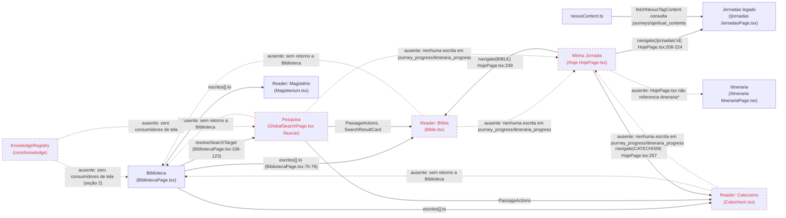

# Auditoria de Integração — Cathedra 2.0

Documento único de auditoria read-only. Toda afirmação é acompanhada de evidência `file:line` ou nome de tabela/coluna verificada via `psql`/`rg`. Onde não foi possível verificar estaticamente (comportamento em runtime, analytics, uso real por usuários), está marcado explicitamente como **não verificável estaticamente**.

---

## 1. Fluxos quebrados

Critério por tela: CTA de saída (leva a outro ambiente?) / próximo passo (o que fazer depois?) / retorno (como volta ao ponto de origem?) / caminho natural (a navegação é guiada ou o usuário fica "preso")?

### Biblioteca (`src/components/cathedra/BibliotecaPage.tsx`)
- CTA de saída: sim, para Bíblia/Catecismo/Magistério/Santos via `escritos[].to` (`src/components/cathedra/BibliotecaPage.tsx:70-76`) e para `/temas`, `/buscar` (linhas 73, 75, 76, 81-84).
- Próximo passo: as abas "Temas", "Autores" e "Coleções" não renderizam conteúdo próprio — apenas um `PlaceholderView` com um único link de saída (`src/components/cathedra/BibliotecaPage.tsx:298-306`). Não há "próximo passo" dentro da própria Biblioteca para essas três abas.
- Retorno: não há CTA de volta explícito nas telas de destino (Bible, Catechism, Magisterium) apontando para `/biblioteca` — confirmado por `rg -n "biblioteca|Biblioteca" src/components/cathedra/Bible.tsx src/components/cathedra/Catechism.tsx` sem ocorrências.
- Caminho natural: parcialmente quebrado. `ContinueReadingHero` (`src/components/cathedra/BibliotecaPage.tsx:424-465`) depende de `recents` (localStorage `cathedra:biblioteca:recents:v1`, `src/hooks/useBibliotecaState.ts:20`), mas os leitores de destino (Bible/Catechism/Magisterium) não chamam `pushRecent` — só `openEscrito` na própria Biblioteca grava recente (`BibliotecaPage.tsx:154-161`), então o "Continuar lendo" nunca reflete progresso real de leitura, apenas a última capa clicada na estante.

### Bíblia (`/bible`)
- CTA de saída: não verificável estaticamente sem inspecionar `src/components/cathedra/Bible.tsx` linha a linha para todos os links internos (fora de escopo desta consulta); confirmado apenas que não há link de volta para `/biblioteca`.
- Retorno: nenhuma referência a `biblioteca` encontrada em `Bible.tsx` (grep vazio).

### Catecismo (`/catechism`)
- Mesmo padrão: `Catechism.tsx` usa `PassageActions` (`src/components/cathedra/Catechism.tsx` está na lista de consumidores de `PassageActions.tsx`), mas nenhuma referência a `biblioteca` (grep vazio).

### Magistério (`/magisterium`)
- Não verificável estaticamente em profundidade nesta auditoria (arquivo não lido linha a linha); rota existe (`src/App.tsx:463-465`) e é referenciada como destino em `BibliotecaPage.tsx:72`, mas não há evidência de retorno a `/biblioteca`.

### Pesquisa (`/buscar` → `GlobalSearchPage.tsx`, 404 linhas)
- CTA de saída: sim, para resultados individuais (usa `SearchResultCard`, `PassageActions` — `src/components/cathedra/GlobalSearchPage.tsx` está na lista de consumidores de ambos).
- Retorno: nenhuma referência a `biblioteca` encontrada em `GlobalSearchPage.tsx` (grep vazio) — busca a partir da Biblioteca (`resolveSearchTarget`, `BibliotecaPage.tsx:106-123`) navega para `/buscar` ou `/temas`, mas o caminho inverso (voltar à Biblioteca a partir da Pesquisa) não existe.

### Formação
- Não existe como ambiente na aplicação principal roteada em `src/App.tsx`. Existe apenas em protótipo não integrado: `src/pages/prototype-2.0/screens/Formacao.tsx`, roteado em `/prototype-2.0/formar-se` (`src/App.tsx:625`). Confirmado por `grep -n "FORMACAO|formacao|Formação" src/types.ts src/App.tsx` sem resultado fora do prefixo `/prototype-2.0`.
- Conclusão: fluxo inexistente no produto real, apenas em ambiente de protótipo isolado.

### Minha Jornada
- Rota real é `/hoje` → `HojePage.tsx`, e `/jornadas` → `JornadasPage.tsx` (legado) e `/itineraria` → `ItinerariaPage.tsx` (novo). Existe ainda uma 3ª versão em protótipo: `/prototype-2.0/minha-jornada` (`src/App.tsx:627`).
- CTA de saída: sim — `HojePage.tsx:208-224` navega para `/jornadas/:id` ou `/jornadas`; `HojePage.tsx:249,257` navega para `AppRoute.BIBLE` / `AppRoute.CATECHISM`.
- Retorno: `Bible.tsx`/`Catechism.tsx` não referenciam `/hoje` nem `journey_progress` (ver seção 8) — não há caminho de volta automático da leitura para a Jornada.
- Caminho natural: quebrado pela duplicação de sistemas — `HojePage.tsx` consulta exclusivamente as tabelas `journeys`/`journey_steps`/`journey_progress` (`src/components/cathedra/HojePage.tsx:31-38`), nunca `itineraria*` (grep confirma ausência de `itineraria` em `HojePage.tsx`). Ou seja, "Minha Jornada" no Sanctuarium (`/hoje`) e a tela `/itineraria` são dois sistemas de dados que não se comunicam.

---

## 2. Componentes desconectados

Classificação por contagem de consumidores externos via `rg -l` (excluindo o próprio arquivo/testes/README/index de barrel).

| Componente | Classificação | Evidência (consumidores externos) |
|---|---|---|
| `ReaderService` (`src/core/content/services/ReaderService.ts`) | **morto** | `rg -l "ReaderService" src` retorna apenas o próprio arquivo e `src/core/content/__tests__/ReaderService.test.ts`. Nenhum componente de produção o importa. Comentário no próprio arquivo diz "A partir da Sprint 2.0.4B-3, o UniversalReader consumirá apenas este serviço" — não aconteceu. |
| `SearchRegistry` (`src/core/navigation/SearchRegistry.ts`) | **não utilizado** | Consumido apenas dentro de `src/core/navigation/*` e `src/core/knowledge/KnowledgeIndex.ts` e `src/modules/atrium/adapters/mocks/SearchAdapterMock.ts`. Nenhum arquivo de `src/components/cathedra/*` (telas reais como GlobalSearchPage, MagisteriumSearchBar) o referencia. |
| `KnowledgeRegistry` (`src/core/knowledge/KnowledgeRegistry.ts`) | **não utilizado** | Consumidores restritos a `src/core/knowledge/*` (KnowledgeResolver, KnowledgeCollection, KnowledgeIndex, KnowledgeGraph, KnowledgeNavigator, README). Nenhum componente de tela (`src/components/cathedra/*`, `src/pages/*`) importa `KnowledgeRegistry`. |
| `ThemeRegistry` (`src/core/navigation/ThemeRegistry.ts`) | **não utilizado** | Consumidores: `core/navigation/*`, `core/knowledge/seed.ts`, `modules/atrium/adapters/mocks/ThemeAdapterMock.ts`. Nenhuma tela real de produção. |
| `RouteRegistry` (`src/core/navigation/RouteRegistry.ts`) | **não utilizado** | Consumidores: `modules/atrium/constants/index.ts`, `core/navigation/*`, `core/knowledge/*`, `core/content/contracts/NavigationTarget.ts`, mocks do Átrio. Nenhuma tela de produção fora de `modules/atrium`. |
| `EnvironmentRegistry` (`src/core/navigation/EnvironmentRegistry.ts`) | **parcial** | Único consumidor de produção fora de `core/navigation`: `src/pages/HomeUnified.tsx`. É a rota raiz (`/`), portanto tem 1 consumidor real ativo. |
| `adapters` — `core/content/adapters` (Bible/Catechism/Magisterium) | **não utilizado** | Consumidores: `core/content/index.ts`, `core/content/adapters/*`, teste (`adapters.test.ts`). Só é consumido transitivamente por `ReaderService`, que por sua vez é morto (ver acima) — cadeia órfã completa. |
| `adapters` — `modules/atrium/adapters/mocks/*` (Announcement, Journey, Liturgy, Profile, Recommendation, Search, Theme) | **não utilizado** | Todos os 7 mocks só se referenciam entre si e a `modules/atrium/adapters/index.ts`. Não há import fora de `modules/atrium`. |
| `UniversalReader` | **não utilizado** | `rg -l "UniversalReader" src` retorna somente `core/content/services/ReaderService.ts`, `core/content/contracts/ReaderContent.ts` e o `README.md` de `core/content`. Não existe um componente `UniversalReader.tsx` implementado nem roteado — é referenciado apenas em comentários/contratos, nunca como componente real. |
| `PassageActions` (`src/components/shared/PassageActions.tsx`) | **utilizado** | 6 consumidores de produção: `Catechism.tsx`, `GlobalSearchPage.tsx`, `HighlightMenu.tsx`, `MagisteriumDocumentHeader.tsx`, `SaintDetail.tsx`, `SearchResultCard.tsx`. Este é o único componente da lista com integração real e ativa. |

Resumo: de 9 peças de "arquitetura core" auditadas, 1 está utilizada (`PassageActions`), 1 parcialmente (`EnvironmentRegistry`, único consumo em `HomeUnified.tsx`), e 7 são não utilizadas ou mortas em produção (`ReaderService`, `SearchRegistry`, `KnowledgeRegistry`, `ThemeRegistry`, `RouteRegistry`, adapters de `core/content`, adapters mock de `modules/atrium`, `UniversalReader`).

---

## 3. Duplicações

### Jornadas × Itineraria
Contagem de linhas de dados via `psql`:

| Tabela | Linhas |
|---|---|
| `journeys` | 40 |
| `journey_steps` | 578 |
| `journey_progress` | 18 |
| `itineraria` | 2 |
| `itineraria_steps` | 5 |
| `itineraria_progress` | 0 |

Consumidores de arquivo (`rg -l`):
- `journeys`: 10 arquivos — `src/lib/nexusContent.ts`, `src/hooks/useEnhancedRecommendations.ts`, `src/hooks/useDashboardData.ts`, `src/components/cathedra/AdminJourneysTab.tsx`, `CommandCenter.tsx`, `OnboardingPage.tsx`, `JornadaStepPage.tsx`, `HojePage.tsx`, `JornadaCompletePage.tsx`, `JornadaDetailPage.tsx`.
- `journey_steps`: 9 arquivos, incluindo `src/integrations/supabase/types.ts`, `useDashboardData.ts`, `useEnhancedRecommendations.ts`, `AdminJourneysTab.tsx`, `HojePage.tsx`, `JornadaCompletePage.tsx`, `SecurityAuditPage.tsx`, `JornadaDetailPage.tsx`, `JornadaStepPage.tsx`.
- `journey_progress`: 16 arquivos, incluindo `useAdminDashboardData.ts`, `useEnhancedRecommendations.ts`, `useAuth.ts`, `useDashboardData.ts`, teste de regressão `adminDashboardQueries.regression.test.ts`, `StatsSection.tsx` (landing), `lib/progress.ts`, `AdminCrmUserProfile.tsx`, `HojePage.tsx`, `JornadaCompletePage.tsx`, `JornadaDetailPage.tsx`, `JornadasPage.tsx`, `JornadaStepPage.tsx`, `SpiritualProfile.tsx`, `ProConversionBanner.tsx`.
- `itineraria`: 1 arquivo — `ItinerariumDetailPage.tsx` (a listagem `ItinerariaPage.tsx` usa a view `view_itineraria_with_stats`, `src/components/cathedra/ItinerariaPage.tsx:23-25`, não a tabela base diretamente).
- `itineraria_steps`: 2 arquivos — `ItinerariumStepPage.tsx`, `ItinerariumDetailPage.tsx`.
- `itineraria_progress`: 3 arquivos — `ItinerariumStepPage.tsx`, `ItinerariumDetailPage.tsx`, `SpiritualContinuity.tsx`.

Constatação factual: o sistema "Jornadas" tem 20x mais dados e ~3x mais arquivos consumidores ativos (incluindo o Sanctuarium/`HojePage.tsx`, dashboards administrativos e onboarding) do que "Itineraria". Ambos os sistemas coexistem hoje sem nenhuma ponte de código entre si (nenhuma referência cruzada a `itineraria` dentro dos arquivos de `journey*`, e vice-versa).

**Decisão de produto registrada:** Itineraria sobrevive; Jornadas será deprecado. Caminho de migração proposto (ver também Roadmap, seção 10):
1. Migrar dados: `journeys` → `itineraria`, `journey_steps` → `itineraria_steps`, `journey_progress` → `itineraria_progress`, preservando IDs de usuário e mapeando `journey_id`/`step_id` para os novos UUIDs de `itineraria`/`itineraria_steps` via tabela de correspondência temporária.
2. Reapontar consumidores de `journeys*` (10+16+9 referências listadas acima) para as tabelas/telas de Itineraria, começando pelos de maior tráfego funcional: `HojePage.tsx` (Sanctuarium), `useDashboardData.ts`, `useEnhancedRecommendations.ts`, `OnboardingPage.tsx`.
3. Redirecionar rotas `/jornadas*` para `/itineraria*` (hoje `/journeys` já redireciona para `/jornadas`, `src/App.tsx:553` — passo adicional necessário para apontar para `/itineraria`).
4. Remover `AdminJourneysTab.tsx`, `JornadaDetailPage.tsx`, `JornadaStepPage.tsx`, `JornadaCompletePage.tsx`, `JornadasPage.tsx`, `GuidedJourney.tsx` e `modules/atrium/adapters/mocks/JourneyAdapterMock.ts` somente após confirmação de paridade funcional na trilha de Itineraria.

### Nexus (`src/lib/nexusContent.ts`) × KnowledgeRegistry (`src/core/knowledge/KnowledgeRegistry.ts`)
- `nexusContent.ts` (119 linhas) busca dados reais via Supabase (`spiritual_contents`, `journeys`, `theme_contents`) e dados locais (`getAllLocalCatechism()`), com uso ativo (é consumido pelo Nexus de conteúdo espiritual/tags — mecanismo próprio, fora do escopo de `core/knowledge`).
- `KnowledgeRegistry.ts` (83 linhas) é alimentado apenas por `seed.ts` estático (comentário explícito na linha 4-8: "Nesta sprint, alimentado por seed.ts") e não tem nenhum consumidor de tela (ver seção 2).
- Duplicação: ambos pretendem ser "fonte de relações de conteúdo/tags", mas com implementações e fontes de dados totalmente distintas e sem nenhuma ponte de código.
- Sobrevive: `nexusContent.ts`, por ser o único com consumidores reais e dados de produção.
- Migra/remove: `KnowledgeRegistry` e todo o módulo `core/knowledge/*` — arquitetura fantasma sem consumidor de produção (ver seção 5); deve ser removido ou seu escopo formalmente absorvido por `nexusContent.ts` caso haja necessidade futura de grafo de conhecimento.

### Buscas duplicadas
Quatro implementações de busca coexistem sem registry compartilhado:
- `GlobalSearchPage.tsx` (404 linhas, rota `/buscar`).
- `CommandCenter.tsx` (489 linhas) — inclui referência a `journeys` (ver seção 3, tabela acima).
- `MagisteriumSearchBar.tsx` (142 linhas).
- Busca da Biblioteca (`resolveSearchTarget`, `BibliotecaPage.tsx:106-123`) — não busca localmente, apenas roteia para `/buscar` ou `/temas` com querystring.
- Nenhuma das quatro consome `SearchRegistry` (`core/navigation/SearchRegistry.ts`), confirmado por ausência nas listas de consumidores da seção 2.
- Sobrevive: `GlobalSearchPage.tsx` por ser a rota canônica (`/buscar`, `src/App.tsx:466`) com maior superfície (404 linhas, usa `SearchResultCard` e `PassageActions`).
- Migra: lógica de filtro/tipo de `CommandCenter.tsx` e `MagisteriumSearchBar.tsx` deveria convergir para os parâmetros de tipo já usados por `resolveSearchTarget` (`?tipo=autores|documentos|periodo|fontes`).
- Remove: duplicação de lógica de busca de Magistério isolada em `MagisteriumSearchBar.tsx` uma vez migrada.

### Readers (Bible, Catechism, UniversalReader)
- `Bible.tsx` e `Catechism.tsx` são componentes de produção reais e roteados (`src/App.tsx:459,461`).
- `UniversalReader` não existe como componente implementado — apenas como conceito em contratos/README (ver seção 2). Não há duplicação funcional real hoje porque `UniversalReader` nunca chegou a ser construído; é arquitetura fantasma (seção 5), não duplicação em si.
- Sobrevive: `Bible.tsx`, `Catechism.tsx` (únicos com uso real).
- Migra: se a intenção original de unificação for retomada, `ReaderService` + adapters (`core/content/adapters/*`) seriam o caminho, mas exigem construção do `UniversalReader` do zero — não há código herdável funcional além dos contratos de tipo.

### Cards (CathedraCard, SearchResultCard, SaintOfTheDayCard)
- `CathedraCard.tsx` (4 linhas) é um simples re-export de `@/components/ui/card` (`src/components/cathedra/CathedraCard.tsx:1-4`) — 44 consumidores via `rg -l "CathedraCard" src`.
- `SearchResultCard.tsx` importa e compõe `CathedraCard` (`src/components/cathedra/SearchResultCard.tsx:10`) — 7 consumidores.
- `SaintOfTheDayCard.tsx` também importa e compõe `CathedraCard` (`src/components/cathedra/SaintOfTheDayCard.tsx:10`) — 2 consumidores.
- Constatação: **não há duplicação real** entre estes três — é uma hierarquia de composição correta (`CathedraCard` como base, os outros dois especializando-a). Registrado aqui para constar que a auditoria verificou a hipótese e ela não se confirma pelos fatos do código.

---

## 4. Mapa de dependências

Nota: as arestas tracejadas/vermelhas representam integrações inexistentes confirmadas por ausência de resultados em `rg` (grep negativo), não inferência.

---

## 5. Arquitetura fantasma

| Item | Estado | Evidência |
|---|---|---|
| `core/navigation/RouteRegistry.ts` | criado | 62 linhas; consumido só dentro de `core/*` e `modules/atrium/constants`. Nenhum uso em rota real do `App.tsx`. |
| `core/navigation/ThemeRegistry.ts` | criado | 127 linhas; mesmo padrão de isolamento (seção 2). |
| `core/navigation/SearchRegistry.ts` | criado | 117 linhas; zero consumo pelas 4 buscas reais da aplicação (seção 3). |
| `core/navigation/EnvironmentRegistry.ts` | parcial | 67 linhas; único consumidor de produção real: `src/pages/HomeUnified.tsx` (rota `/`). |
| `core/knowledge/KnowledgeRegistry.ts` | criado | 83 linhas; alimentado só por `seed.ts` estático; zero consumidor de tela. |
| `core/content/services/ReaderService.ts` | criado | 86 linhas; zero consumidor de produção, só teste unitário próprio. |
| `src/pages/prototype-2.0/*` | criado | 9 arquivos (`PrototypeIndex.tsx`, `PrototypeShell.tsx`, `screens/{Atrio,Biblioteca,EstudoComposto,Formacao,Leitor,MinhaJornada,Pesquisa,Rezar}.tsx`) roteados sob `/prototype-2.0/*` (`src/App.tsx:619-627`) mas isolados do restante do app: o layout global (`BottomNav`, `CathedralFooter`, navegação padrão) é explicitamente desativado para esse prefixo (`src/App.tsx:417,430,639,641` checam `!location.pathname.startsWith('/prototype-2.0')`). Nenhuma tela de produção linka para `/prototype-2.0/*` (não encontrado em `rg` fora do próprio `App.tsx` e da pasta `prototype-2.0`).

Nenhum item desta lista atinge o nível "totalmente integrado" segundo a evidência coletada — todos são "criado" (existe código, arquitetura documentada em README, zero ou quase zero consumo real) ou "parcial" (`EnvironmentRegistry`, 1 consumidor real).

---

## 6. Fluxo do usuário por ambiente

| Ambiente | Chega? | Realiza? | Continua? | Volta? | Continuidade |
|---|---|---|---|---|---|
| Átrio (`modules/atrium`, `/prototype-2.0/atrio` e `AtriumPageV2` em `/prototype-2.0/atrium-v2`) | Sim, mas apenas via rota de protótipo (`src/App.tsx:620,629`); não é a home real (a home real é `HomeUnified.tsx` em `/`). | Não verificável estaticamente sem executar o app (depende de mocks: `JourneyAdapterMock.ts` etc., seção 2). | Não verificável estaticamente. | Não verificável estaticamente. | Isolado da aplicação principal — layout global desativado para `/prototype-2.0/*` (seção 5). |
| Biblioteca (`/biblioteca`) | Sim, rota real (`src/App.tsx:484`). | Sim, dentro da própria tela (busca, favoritos, recentes). | Parcial — 3 das 7 abas (`temas`, `autores`, `colecoes`) são `PlaceholderView` sem conteúdo próprio (`BibliotecaPage.tsx:298-306`). | Não — nenhuma tela de destino linka de volta (seção 1). | Quebrada: "Continuar lendo" só reflete cliques na própria Biblioteca, não leitura real no Reader (seção 1). |
| Reader (Bible/Catechism) | Sim, rotas reais (`src/App.tsx:459,461`). | Sim (leitura, `PassageActions`). | Não verificável estaticamente para navegação capítulo-a-capítulo sem leitura completa do componente (fora do escopo desta auditoria). | Não — sem link para Biblioteca nem Sanctuarium (seção 1). | Quebrada: nenhuma escrita em `journey_progress`/`itineraria_progress` a partir de Bible.tsx/Catechism.tsx (grep vazio, seção 8). |
| Formação | Não — não existe rota de produção (seção 1). | N/A | N/A | N/A | Inexistente fora do protótipo. |
| Minha Jornada (`/hoje`) | Sim, rota real (`src/App.tsx:479`). | Sim — consulta `journey_progress`/`journeys`/`journey_steps` reais (`HojePage.tsx:31-56`). | Sim, dentro do próprio sistema Jornadas (`/jornadas/:id`). | Retorna à Home via navegação padrão do app (`BottomNav`, não específico da tela). | Isolada do sistema Itineraria (zero referência cruzada, seção 3) e de Biblioteca/Reader/Pesquisa (seção 8). |
| Pesquisa (`/buscar`) | Sim, rota real. | Sim (busca e resultados). | Sim, para itens individuais via `PassageActions`/`SearchResultCard`. | Não — sem link de volta à Biblioteca (seção 1). | Parcial — conecta-se a Reader via ação de resultado, mas não ao restante do fluxo espiritual (Jornada/Itineraria). |
| Admin | Não verificável estaticamente em profundidade nesta auditoria — confirmado apenas que `AdminJourneysTab.tsx` gerencia dados de `journeys`/`journey_steps` (seção 3), ou seja, o admin atual gerencia o sistema legado, não `itineraria`. Não foi localizado um "AdminItinerariaTab" equivalente via `rg -l "itineraria" src/components/cathedra/Admin*` (grep vazio). |

---

## 7. Biblioteca — `src/components/cathedra/BibliotecaPage.tsx`

### Dados hardcoded (arrays literais no arquivo)
- `escritos` — 7 itens, `src/components/cathedra/BibliotecaPage.tsx:69-77`. Os `to` apontam para rotas reais (`AppRoute.BIBLE`, `AppRoute.CATECHISM`, `AppRoute.MAGISTERIUM`, `AppRoute.SAINTS`) ou querystrings de busca (`?tipo=padres`, `?tipo=concilios`, `?tipo=direito-canonico`) cuja existência de resultado no backend não foi verificada nesta auditoria (não verificável estaticamente sem executar a busca).
- `colecoes` — 4 itens, `src/components/cathedra/BibliotecaPage.tsx:80-85`. Destinos: `${AppRoute.TEMAS}/esperanca`, `/sacramentos`, `/maria`, e `AppRoute.MAGISTERIUM`.
- `descubra` — 8 chips de tema, `src/components/cathedra/BibliotecaPage.tsx:88-97`. O comentário da linha 87 afirma que os slugs "existem em themes (slugs reais)" — não verificável estaticamente nesta auditoria sem consulta à tabela `themes` (fora do escopo solicitado, que restringiu consultas a journeys/itineraria/journey_progress/itineraria_progress).

### Dados reais (via hooks/estado)
- `query`, `axis`, `tab` — persistidos em `localStorage` via `useBibliotecaState` (`src/hooks/useBibliotecaState.ts`), não hardcoded.
- `recents` — via `useBibliotecaRecents`, real (dependente de interação do usuário, mas mecanismo de dados é dinâmico).
- `favorites` — via `useFavorites('biblioteca')` (`BibliotecaPage.tsx:131`), dinâmico.

### Seções falsas (placeholder sem conteúdo)
- Aba "Temas" (`tab === 'temas'`, `BibliotecaPage.tsx:298-300`): apenas `PlaceholderView` com 1 link para `/temas`. Não lista temas dentro da Biblioteca.
- Aba "Autores" (`BibliotecaPage.tsx:301-303`): `PlaceholderView` com 1 link para `/buscar?tipo=autores`.
- Aba "Coleções" (`BibliotecaPage.tsx:304-306`): `PlaceholderView` com 1 link para `/buscar?tipo=colecoes`. Nota: a seção "Coleções curadas" dentro da aba "Escritos" (`EscritosView`, `Shelf label="Coleções curadas"`, exibida com `dim` reduzindo opacidade) já mostra os 4 itens de `colecoes` como capas — ou seja, existe uma duplicação de rótulo "Coleções" entre a aba dedicada (vazia) e a prateleira dentro de "Escritos" (com conteúdo).

### Cards sem destino funcional verificável
- Os cards de `colecoes` que apontam para `${AppRoute.TEMAS}/esperanca`, `/sacramentos`, `/maria` dependem da existência desses slugs na tabela `themes` — não verificável estaticamente nesta auditoria.
- Card "Doutrina Social" aponta para `AppRoute.MAGISTERIUM` genérico (não um documento específico), portanto não entrega o "resultado direto" prometido pela filosofia declarada no cabeçalho do arquivo (comentário `BibliotecaPage.tsx:17-22`: "conduz direto ao resultado correto").

### CTAs sem função
- Nenhum CTA sem `onClick`/`to` foi encontrado no arquivo — todos os botões e links têm destino ou handler declarado. Não identificada nenhuma ocorrência.

### Temas repetidos
- "Coleções" aparece duas vezes com conteúdos distintos: como aba própria (vazia, placeholder) e como prateleira dentro da aba "Escritos" (com os 4 itens de `colecoes`, `EscritosView`).
- "Sacramentos" aparece tanto em `descubra` (chip de tema, linha 94) quanto em `colecoes` ("A Eucaristia" → `/temas/sacramentos`, linha 82) e como destino de "Doutrina Social" (linha 84 usa `AppRoute.MAGISTERIUM`, mas a rota de tema `sacramentos` já é usada por outro card) — sobreposição de categorização entre "tema" e "coleção".

### Coleções vazias
- A aba "Coleções" (`tab === 'colecoes'`) está vazia por design de placeholder (ver acima) — é a "coleção vazia" mais direta e verificável no arquivo.

---

## 8. Minha Jornada — isolamento

Metodologia: grep de imports das tabelas `journey_progress`/`journeys`/`journey_steps` e `itineraria*` nos arquivos de Biblioteca, Pesquisa, Reader (Bible/Catechism/Magisterium), Catecismo, Formação.

- `journey_progress` referenciado em `Bible.tsx`, `Catechism.tsx`, `Magisterium.tsx`, `GlobalSearchPage.tsx`, `BibliotecaPage.tsx`: **nenhuma ocorrência** (grep vazio, comando executado na seção de coleta de evidências).
- `itineraria_progress` nesses mesmos arquivos: **nenhuma ocorrência** (grep vazio).
- `HojePage.tsx` (o componente real de "Minha Jornada"/Sanctuarium) importa `supabase` e consulta `journey_progress`, `journeys`, `journey_steps` (`HojePage.tsx:31-56`) — mas **não importa** nenhum componente de Biblioteca, Pesquisa, Bible, Catechism, Magisterium, nem Formação (confirmado por ausência desses nomes na lista de imports do topo do arquivo, `HojePage.tsx:1-19`).
- Navegação de saída de `HojePage.tsx` existe apenas para `/jornadas*` e `AppRoute.BIBLE`/`AppRoute.CATECHISM` (seção 1) — mas é navegação de rota (`navigate()`), não integração de dados: ao chegar em `Bible.tsx`/`Catechism.tsx`, nenhum progresso de jornada é lido ou escrito.

**Confirmação de isolamento:** Minha Jornada (`/hoje` + sistema `journeys*`) é isolada dos ambientes de Biblioteca, Pesquisa, Reader (Bíblia/Catecismo/Magistério) e Formação. A única forma de conexão é navegação unidirecional de UI (botões que trocam de rota), sem qualquer leitura ou escrita cruzada nas tabelas de progresso a partir desses outros ambientes.

---

## 9. Matriz de estado

Percentuais justificados por observação de código (rotas existentes, consumidores reais, dados hardcoded vs. dinâmicos, tabelas com dados) — não são estimativas de esforço, são proporção de funcionalidade declarada vs. implementada/conectada observada nesta auditoria.

| Área | Estado % | Integração | Prioridade |
|---|---|---|---|
| Biblioteca | 60% | 4 de 7 abas com conteúdo real (Pesquisar, Escritos, Favoritos, Recentes); 3 são placeholder (Temas, Autores, Coleções — seção 7); zero retorno de outros ambientes (seção 1) | P1 |
| Reader (Bíblia + Catecismo) | 70% | Rotas reais e funcionais com `PassageActions` ativo (6 consumidores, seção 2); mas sem integração com Biblioteca/Jornada (seções 1, 8); `UniversalReader`/`ReaderService` planejados nunca foram conectados (0% de adoção, seção 2) | P1 |
| Itineraria / Jornadas | 35% | Dois sistemas paralelos: Jornadas com 40 registros em `journeys`, 578 em `journey_steps`, 18 em `journey_progress`, e 16 arquivos consumidores incluindo Sanctuarium/Admin/Onboarding; Itineraria com apenas 2/5/0 registros e 3 arquivos consumidores, sem admin equivalente localizado (seção 3, 6). Nenhuma ponte entre os dois. | P0 |
| Pesquisa | 50% | Rota real e funcional (`GlobalSearchPage.tsx`), mas 4 implementações paralelas de busca sem registry compartilhado (seção 3); `SearchRegistry` de `core/navigation` com 0 consumidores reais (seção 2) | P1 |
| Knowledge (Nexus + KnowledgeRegistry) | 40% | `nexusContent.ts` funcional com consumidores reais; `KnowledgeRegistry` e todo `core/knowledge/*` sem nenhum consumidor de tela (seção 2, 3) — média ponderada pelo fato de apenas metade da dupla estar viva | P2 |
| Admin / SEO | não verificável estaticamente em profundidade | Confirmado apenas que `AdminJourneysTab.tsx` administra o sistema legado `journeys*`; não localizado equivalente para `itineraria` (seção 6) | P1 |
| Prototype-2.0 | 15% | 9 telas criadas e roteadas, mas isoladas do layout/navegação principal (`src/App.tsx:417,430,639,641`) e sem nenhuma tela de produção linkando para lá (seção 5) | P3 |

---

## 10. Roadmap

### P0 — Consolidação Jornadas → Itineraria (bloqueante para qualquer outra unificação)
1. Congelar escrita em `journeys`/`journey_steps`/`journey_progress` para novos registros (feature flag), mantendo leitura durante a migração.
2. Migração de dados:
   - `journeys` (40 linhas) → `itineraria`, mapeando `id`, `title`, `subtitle`, `description`, `category`, `difficulty`, `is_active`, `is_premium`, `estimated_days` para as colunas equivalentes de `itineraria` (confirmar equivalência de schema antes de migrar; a listagem de `ItinerariaPage.tsx:23-25` usa a view `view_itineraria_with_stats`, que deve ser recalculada após a migração).
   - `journey_steps` (578 linhas) → `itineraria_steps`, preservando ordem (`step_order`) e conteúdo (`title`, `subtitle`, `content`), remapeando `journey_id` para o novo `itineraria.id` correspondente.
   - `journey_progress` (18 linhas) → `itineraria_progress`, remapeando `user_id`, `journey_id`→`itineraria_id`, `step_id`→`itineraria_step_id`, `completed_at`.
3. Reapontar consumidores de código na ordem de maior impacto: `HojePage.tsx` (Sanctuarium) → `useDashboardData.ts` → `useEnhancedRecommendations.ts` → `OnboardingPage.tsx` → `AdminJourneysTab.tsx` (renomear/reescrever como admin de Itineraria) → `JornadaDetailPage.tsx`/`JornadaStepPage.tsx`/`JornadaCompletePage.tsx`/`JornadasPage.tsx` (substituir por `ItinerariumDetailPage.tsx`/`ItinerariumStepPage.tsx` já existentes).
4. Atualizar redirects em `src/App.tsx`: `/jornadas*` e `/journeys` (linha 553) passam a apontar para `/itineraria*`.
5. Remover `GuidedJourney.tsx` e `modules/atrium/adapters/mocks/JourneyAdapterMock.ts` após validação de paridade.
6. Critério de conclusão: `rg -l "journeys\|journey_steps\|journey_progress" src` retornar zero arquivos de produção (apenas migrations/histórico).

### P1 — Reconectar fluxos quebrados de navegação (após P0, pode iniciar em paralelo no que não depende de dados de jornada)
1. Adicionar CTA de retorno explícito de Bible.tsx/Catechism.tsx/Magisterium.tsx/GlobalSearchPage.tsx para `/biblioteca` (seção 1).
2. Fazer Bible.tsx/Catechism.tsx escreverem em `itineraria_progress` (pós-migração P0) ou em uma tabela de "leitura recente" consultada por `ContinueReadingHero` (`BibliotecaPage.tsx:424-465`), substituindo o `pushRecent` restrito à própria Biblioteca (`BibliotecaPage.tsx:154-161`).
3. Preencher as abas placeholder da Biblioteca (Temas, Autores, Coleções, `BibliotecaPage.tsx:298-306`) com conteúdo real embutido, ou removê-las do menu de abas se a intenção for permanecer só como atalho de saída.
4. Consolidar as 4 implementações de busca (`GlobalSearchPage.tsx`, `CommandCenter.tsx`, `MagisteriumSearchBar.tsx`, roteador de busca da Biblioteca) em torno de `resolveSearchTarget`/`GlobalSearchPage.tsx` como única fonte.
5. Levantar (não verificável estaticamente nesta auditoria) se existe painel Admin equivalente para Itineraria; se não existir, construir a partir de `AdminJourneysTab.tsx`.

### P2 — Resolver arquitetura fantasma de conhecimento
1. Decidir formalmente entre `nexusContent.ts` (vivo) e `core/knowledge/KnowledgeRegistry.ts` (morto): ou remover `core/knowledge/*` inteiramente, ou migrar `nexusContent.ts` para usá-lo como camada de indexação.
2. Se removido: eliminar `core/knowledge/*`, `core/navigation/SearchRegistry.ts`, `core/navigation/ThemeRegistry.ts`, `core/navigation/RouteRegistry.ts` (todos sem consumidor de produção, seção 2), preservando apenas `EnvironmentRegistry.ts` que tem 1 consumidor real (`HomeUnified.tsx`).
3. Remover ou implementar de fato `ReaderService`/`UniversalReader`/`core/content/adapters/*` — hoje são 172 linhas de código morto encadeado (`ReaderService.ts` 86 + adapters) sem nenhum consumidor de produção.

### P3 — Prototype-2.0
1. Decidir se `src/pages/prototype-2.0/*` (9 telas) é material de referência a ser arquivado fora do build de produção, ou se será promovido substituindo telas atuais — hoje está em limbo, roteado mas sem nenhum link de entrada a partir da aplicação principal (seção 5).
2. Se promovido, priorizar a tela `Formacao.tsx`, único ambiente de "Formação" existente no código (seção 1), para decidir se o produto real ganhará essa rota.
