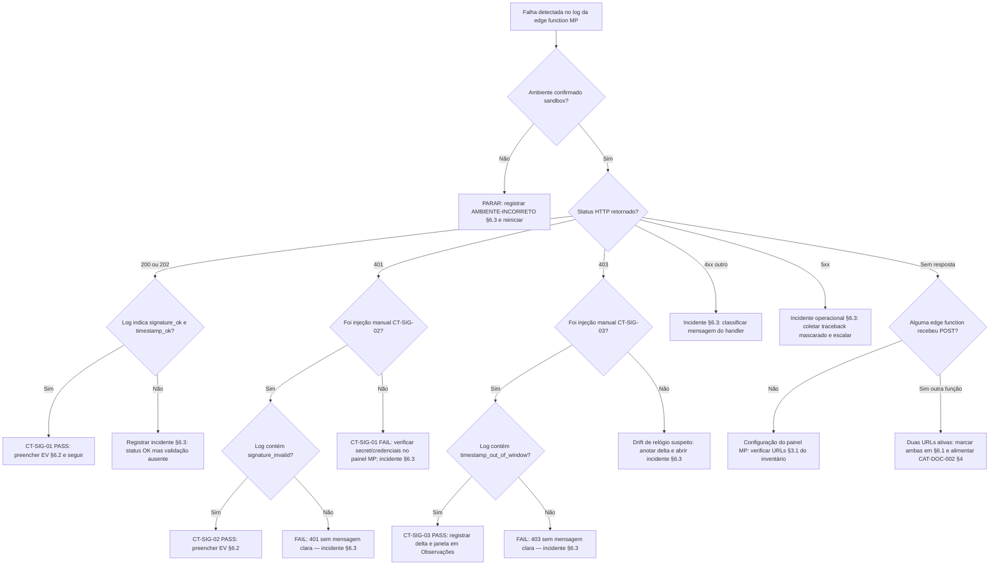

# Sprint S0 — Estabilização Final (Pré-Evento)

**Objetivo:** chegar ao evento (D-6) com base documental consistente, zero risco operacional introduzido, e processo claro para retomar evoluções arquiteturais pós-evento.

**Regra de ouro:** nenhuma alteração de código de aplicação, banco, edge function ou comportamento do sistema durante esta sprint. Apenas documentação, validação e preparação operacional.

**Data de abertura:** 2026-07-16
**Data alvo de encerramento:** D-1 do evento

---

## Legenda de status

- ☐ Não iniciado
- 🟡 Em andamento
- ✅ Concluído
- 🔒 Bloqueado (registrar bloqueio em Observações)

---

## 1. Arquitetura

| Item                                                 | Objetivo                                                                 | Responsável | Status | Evidência                              | Observações |
| ---------------------------------------------------- | ------------------------------------------------------------------------ | ----------- | ------ | -------------------------------------- | ----------- |
| Documentação de arquitetura de referência criada     | 9 documentos em `docs/architecture/` cobrindo estado atual e homologado  | Lovable     | ✅     | `docs/architecture/` (9 arquivos)      | Fase 1 homologada |
| Revisão final dos documentos de arquitetura          | Arquiteto revisa cada arquivo e sinaliza correções documentais           | <preencher> | ☐      | Comentários / issues                   |             |
| Backlog arquitetural registrado sem execução         | Propostas pós-evento separadas do estado atual em cada doc               | Lovable     | ✅     | Seções "Backlog" em cada arquivo       |             |

## 2. ADRs (CAT-DOC-001)

| Item                                            | Objetivo                                                              | Responsável | Status | Evidência                          | Observações |
| ----------------------------------------------- | --------------------------------------------------------------------- | ----------- | ------ | ---------------------------------- | ----------- |
| Registro formal da ausência dos ADRs 001–010    | `docs/adrs/ADR-STATUS.md` com inventário e status                     | Lovable     | ✅     | `docs/adrs/ADR-STATUS.md`          |             |
| Template MADR publicado                         | `docs/adrs/TEMPLATE-ADR.md` disponível para uso                       | Lovable     | ✅     | `docs/adrs/TEMPLATE-ADR.md`        |             |
| README dos ADRs publicado                       | Ciclo de vida e plano de reconstrução documentados                    | Lovable     | ✅     | `docs/adrs/README.md`              |             |
| Reconstrução dos ADRs 001–010                   | Reconstruir a partir de evidências pós-hoc                            | <preencher> | ☐      | ADR-001.md ... ADR-010.md          | **Pós-evento** — não executar antes |

## 3. Mercado Pago (CAT-DOC-002)

| Item                                                       | Objetivo                                                                       | Responsável | Status | Evidência                                     | Observações |
| ---------------------------------------------------------- | ------------------------------------------------------------------------------ | ----------- | ------ | --------------------------------------------- | ----------- |
| Inventário de webhooks criado                              | `docs/MP-WEBHOOK-URLS-INVENTORY.md` publicado com bloqueio arquitetural        | Lovable     | ✅     | `docs/MP-WEBHOOK-URLS-INVENTORY.md`           |             |
| Banner de bloqueio na arquitetura de edge functions        | `docs/architecture/EDGE-FUNCTIONS.md` sinaliza bloqueio                        | Lovable     | ✅     | `EDGE-FUNCTIONS.md` §Duplicações              |             |
| Preenchimento das seções 3.1–3.3 (URLs do painel MP)       | Coletar URLs cadastradas, App ID, eventos assinados                            | Usuário     | 🔒     | Seções 3.1–3.3 preenchidas                    | **Bloqueio ativo** para consolidar funções |
| Preenchimento da seção 4 (decisão de consolidação)         | Escolher nome canônico, plano de descomissionamento                            | <preencher> | ☐      | Seção 4 preenchida                            | Depende de 3.1–3.3 |
| Consolidação das duas edge functions                       | Fundir código na função canônica                                               | —           | 🔒     | —                                             | **Pós-evento** — bloqueado por inventário |

## 4. Banco de Dados

| Item                                          | Objetivo                                                          | Responsável | Status | Evidência                          | Observações |
| --------------------------------------------- | ----------------------------------------------------------------- | ----------- | ------ | ---------------------------------- | ----------- |
| Nenhuma migration durante S0                  | Congelamento total do schema                                      | <preencher> | 🟡     | `supabase/migrations/` sem novos   | Regra da sprint |
| Verificação de RLS habilitada em tabelas novas | Rodar `security scan` e revisar findings                          | <preencher> | ☐      | Relatório do scanner               |             |
| Verificação de GRANTs em tabelas públicas     | Confirmar GRANTs conforme padrão                                  | <preencher> | ☐      | Query em `information_schema`      |             |

## 5. Edge Functions

| Item                                                | Objetivo                                                              | Responsável | Status | Evidência                     | Observações |
| --------------------------------------------------- | --------------------------------------------------------------------- | ----------- | ------ | ----------------------------- | ----------- |
| Nenhum deploy/delete de edge function durante S0    | Congelamento total                                                    | <preencher> | 🟡     | —                             | Regra da sprint |
| Revisão de logs das funções críticas (últimas 24h)  | `mercadopago-webhook`, `mercado-pago-webhook`, `pcl-*`, `bible-*`     | <preencher> | ☐      | Print/anotação dos logs       |             |

## 6. Smoke Tests

| Item                                    | Objetivo                                                        | Responsável | Status | Evidência              | Observações |
| --------------------------------------- | --------------------------------------------------------------- | ----------- | ------ | ---------------------- | ----------- |
| Login / logout                          | Fluxo completo sem erro                                         | <preencher> | ☐      | Screenshot / vídeo     |             |
| Leitura da Bíblia (livro/capítulo)      | Renderiza < 200ms, sem erro de console                          | <preencher> | ☐      | DevTools timing        |             |
| Busca bíblica                           | Retorna resultados < 100ms                                      | <preencher> | ☐      | DevTools timing        |             |
| Nexus (popover de referência cruzada)   | Abre sem quebrar contexto                                       | <preencher> | ☐      | Screenshot             |             |
| Magisterium — categoria e documento     | Lista e detalhe carregam                                        | <preencher> | ☐      | Screenshot             |             |
| Liturgia do dia                         | Cálculo Computus correto para hoje                              | <preencher> | ☐      | Comparação vatican.va  |             |
| Checkout Mercado Pago (sandbox)         | Preferência gerada + webhook recebido + upgrade aplicado        | <preencher> | ☐      | Log do webhook         | **Não testar em produção** |
| Recebimento de webhook MP (sandbox)     | Registrar qual edge function (`mercadopago-webhook` vs. `mercado-pago-webhook`) recebeu cada evento — ver §6.1 | <preencher> | ☐      | Tabela §6.1 preenchida | Alimenta CAT-DOC-002 |
| Logos AI (usuário free)                 | Responde e respeita cap 5 msgs/dia                              | <preencher> | ☐      | Screenshot             |             |
| Mobile (viewport 375px)                 | Todos os fluxos acima renderizam sem overflow                   | <preencher> | ☐      | Screenshots            |             |

### 6.1 Teste de recebimento de webhook MP em sandbox (evidência CAT-DOC-002)

**Objetivo:** para cada evento disparado em sandbox, registrar qual das duas edge functions o Mercado Pago realmente invocou. Alimenta o inventário [`MP-WEBHOOK-URLS-INVENTORY.md`](./MP-WEBHOOK-URLS-INVENTORY.md) §3.1–3.3 sem alterar código.

**Pré-condições:**
- Aplicação Mercado Pago em modo **sandbox** (credenciais `TEST-`) — nunca produção.
- Cartão de teste MP oficial (nunca cartão real).
- Acesso a logs das edge functions (`mercadopago-webhook` e `mercado-pago-webhook`).
- Acesso à tabela `public.webhook_logs` (via ferramenta de banco).

**Procedimento (executar 1x por evento):**

1. Gerar preferência em sandbox pelo fluxo normal do app (`UpgradePage` → checkout).
2. Concluir o pagamento com cartão de teste MP.
3. Aguardar ~30s.
4. Coletar evidência em **dois lugares**, em ordem:
   - **Logs das edge functions:** identificar em qual das duas funções apareceu um POST com `payment.created` / `payment.updated` correlacionado ao `external_reference` da preferência.
   - **Tabela `public.webhook_logs`:** consultar por `provider = 'mercado_pago'` e o `external_reference` da preferência; se houver linha, o handler foi `mercado-pago-webhook` (só ele grava nesta tabela — ver `docs/MP-WEBHOOK-AUDIT.md` §3).
5. Anotar resultado na tabela abaixo.
6. Se **ambas** as funções receberem o mesmo evento: registrar as duas na coluna "Função receptora" e sinalizar em Observações — significa que o painel MP tem as duas URLs cadastradas.
7. Se **nenhuma** receber: pagamento não gerou callback → problema de configuração no painel MP; registrar e não avançar consolidação.

#### Checklist passo a passo (execução guiada)

Rodar **em ordem**. Cada passo indica **onde coletar** a evidência correspondente. Nenhum passo altera código, configuração das funções ou dados de produção.

| # | Passo                                                                 | Onde executar                                        | Onde coletar a evidência                                                                                              | Campo alimentado (§6.1 / §6.2)                            |
| - | --------------------------------------------------------------------- | ---------------------------------------------------- | --------------------------------------------------------------------------------------------------------------------- | --------------------------------------------------------- |
| 0 | Confirmar credenciais **sandbox** ativas (chaves `TEST-…`)             | Painel MP → Credenciais de teste                     | Screenshot com "Modo de teste" visível (mascarar tokens)                                                              | §6.2 → `App ID MP (sandbox)`, `Ambiente`                  |
| 1 | Confirmar URL(s) de webhook registradas no painel MP                   | Painel MP → Suas integrações → Webhooks              | Anotar URL exata cadastrada                                                                                           | Inventário CAT-DOC-002 §3.1 / §6.2 → `Handler`            |
| 2 | Anotar `git rev-parse HEAD` do ambiente atual                          | Terminal do repo                                     | Copiar SHA                                                                                                            | §6.2 → `Observações` (referência de release)              |
| 3 | Gerar preferência: `UpgradePage` → botão "Assinar" em modo sandbox     | App (browser)                                        | DevTools → Network → resposta de `mercadopago-create-preference`: copiar `external_reference` e `preference_id`       | §6.1 → `external_reference`; §6.2 → `external_reference`  |
| 4 | Concluir checkout com cartão de teste MP (**nunca cartão real**)        | Fluxo padrão MP                                      | Screenshot da tela "Pagamento aprovado" (sandbox)                                                                     | §6.1 → `#` linha; §6.2 → `payment_id`                     |
| 5 | Aguardar 30s. Consultar logs da edge function `mercadopago-webhook`    | Ferramenta de logs de edge functions                 | Filtrar por `external_reference` do passo 3. Anotar: presença/ausência de POST, status HTTP, latência                 | §6.1 → coluna "Função receptora"; §6.2 → `Status HTTP`, `Latência` |
| 6 | Repetir passo 5 para `mercado-pago-webhook`                            | Ferramenta de logs de edge functions                 | Mesmos campos do passo 5                                                                                              | §6.1 → coluna "Função receptora"; §6.2 → `Status HTTP`    |
| 7 | Consultar `public.webhook_logs`                                        | Ferramenta de banco (read-only)                      | `SELECT id, event_type, status, created_at FROM webhook_logs WHERE provider='mercado_pago' ORDER BY created_at DESC LIMIT 20;` — localizar linha correlacionada | §6.1 → coluna "Linha em `webhook_logs`?"; §6.2 → `id`     |
| 8 | Extrair payload cru do log da função receptora                         | Logs da edge function identificada nos passos 5–6    | Copiar corpo JSON do POST                                                                                             | Base para o payload mascarado do próximo passo            |
| 9 | Mascarar payload (e-mail, documento, tokens, `x-signature`)            | Editor local                                         | Salvar como `docs/evidencias/mp-sandbox/EV-<NNN>.json` (criar diretório na hora); calcular `sha256sum` do arquivo     | §6.2 → `Arquivo do payload mascarado`, `Hash SHA-256`     |
| 10| Verificar validação de assinatura HMAC no log (mensagens do handler)   | Logs da edge function receptora                      | Anotar se o handler logou `signature_ok` / `signature_invalid` / `timestamp_out_of_window` (ou equivalente)           | §6.2 → `Assinatura HMAC válida?`, `Janela de timestamp OK?` |
| 11| Verificar idempotência: disparar novo `payment.updated` do MESMO pagamento (via "Simular notificação" no painel MP, se disponível) | Painel MP → Webhooks → Simular    | Confirmar em `webhook_logs` se surgiu duplicata ou se foi ignorada por idempotência                                   | §6.2 → `Idempotência respeitada?`                         |
| 12| Preencher a linha da tabela §6.1 e um bloco §6.2 completo              | Editor do doc                                        | —                                                                                                                     | §6.1 (linha) + §6.2 (bloco `EV-<NNN>`)                    |
| 13| Repetir passos 3–12 até ter no mínimo 3 evidências (critério de sucesso) | —                                                  | —                                                                                                                     | §6.1 (linhas 1–3+)                                        |
| 14| Preencher "Conclusão do teste" ao final de §6.1                        | Editor do doc                                        | Consolidar função receptora predominante e divergências                                                               | §6.1 → bloco "Conclusão do teste"                         |

**Regras invioláveis do checklist:**
- Nunca executar em produção. Se em algum passo houver dúvida sobre o ambiente, abortar e registrar em Observações.
- Nunca colar valores brutos de `x-signature`, tokens ou dados de cartão nas evidências — sempre mascarar conforme §6.2.
- Se um passo não puder ser executado (ex.: painel MP sem "Simular notificação"), marcar `n-a` e explicar em Observações. **Não pular sem registrar.**
- Nenhum passo autoriza alterar código das edge functions — o bloqueio CAT-DOC-002 continua ativo.


**Critérios objetivos de sucesso:**
- Pelo menos 3 eventos capturados com função receptora identificada.
- 100% dos eventos com correlação inequívoca a um `external_reference`.
- Nenhum acesso a produção durante o teste.
- Nenhuma alteração de código ou de configuração das funções.

**Tabela de evidências (preencher durante execução):**

| # | Data/hora (BRT) | `external_reference` | Evento MP           | Função receptora (via logs)                        | Linha em `webhook_logs`? | App ID sandbox | Executor       | Observações |
| - | --------------- | -------------------- | ------------------- | -------------------------------------------------- | ------------------------ | -------------- | -------------- | ----------- |
| 1 | `<preencher>`   | `<preencher>`        | `payment.created`   | ☐ `mercadopago-webhook`  ☐ `mercado-pago-webhook`  | ☐ sim  ☐ não             | `<preencher>`  | `<preencher>`  | `<preencher>` |
| 2 | `<preencher>`   | `<preencher>`        | `payment.updated`   | ☐ `mercadopago-webhook`  ☐ `mercado-pago-webhook`  | ☐ sim  ☐ não             | `<preencher>`  | `<preencher>`  | `<preencher>` |
| 3 | `<preencher>`   | `<preencher>`        | `payment.updated`   | ☐ `mercadopago-webhook`  ☐ `mercado-pago-webhook`  | ☐ sim  ☐ não             | `<preencher>`  | `<preencher>`  | `<preencher>` |
| 4 | `<preencher>`   | `<preencher>`        | `<preencher>`       | ☐ `mercadopago-webhook`  ☐ `mercado-pago-webhook`  | ☐ sim  ☐ não             | `<preencher>`  | `<preencher>`  | `<preencher>` |

**Conclusão do teste (preencher ao final):**
- Função receptora predominante em sandbox: `<preencher>`
- Coincide com a URL cadastrada no painel MP (seção 3.1 do inventário)? `<preencher>` (sim/não)
- Divergências detectadas: `<preencher>`
- Recomendação para CAT-DOC-002 §4 (nome canônico): `<preencher>`
- Responsável pela conclusão: `<preencher>`
- Data: `<preencher>`

### 6.2 Template padronizado de evidência (por evento capturado)

Copiar este bloco para cada evento registrado em §6.1. **Não inventar valores** — usar `<preencher>` para o que não puder ser observado. Nunca colar segredos ou dados de cartão real.

```
── EVIDÊNCIA DE WEBHOOK MP (SANDBOX) ────────────────────────────────
ID interno da evidência:    EV-<NNN>
Data/hora captura (BRT):    <preencher>  (ISO 8601: 2026-07-DDTHH:MM:SS-03:00)
Ambiente:                   sandbox      (NUNCA "production")
App ID MP (sandbox):        <preencher>
external_reference:         <preencher>
payment_id (MP):            <preencher>
Tipo de evento:             <preencher>  (payment.created | payment.updated | merchant_order | ...)

── HANDLER OBSERVADO ────────────────────────────────────────────────
Edge function receptora:    <preencher>  (mercadopago-webhook | mercado-pago-webhook)
Fonte da atribuição:        <preencher>  (edge_function_logs | webhook_logs | ambos)
Status HTTP retornado:      <preencher>  (200 | 4xx | 5xx)
Latência (ms):              <preencher>
Linha em webhook_logs?      <preencher>  (sim/não + id da linha se sim)

── PAYLOAD ─────────────────────────────────────────────────────────
Arquivo do payload mascarado: <preencher>  (caminho relativo, ex.: docs/evidencias/mp-sandbox/EV-001.json)
Hash SHA-256 do arquivo:      <preencher>
Máscara aplicada em:          payer.email, payer.identification, card.*, tokens de acesso
Header x-signature (mascarado): <preencher>  (ex.: "ts=...,v1=abcd…<truncado>")
Header x-request-id:           <preencher>

── VALIDAÇÃO ────────────────────────────────────────────────────────
Assinatura HMAC válida?     <preencher>  (sim/não/n-a — n-a se handler não valida)
Janela de timestamp OK?     <preencher>  (sim/não/n-a)
Idempotência respeitada?    <preencher>  (sim/não — checar duplicata em webhook_logs)
Executor:                   <preencher>
Observações:                <preencher>
─────────────────────────────────────────────────────────────────────
```

**Regras de preenchimento:**
- Um bloco por evento. Numerar `EV-001`, `EV-002`, …
- Salvar arquivos de payload em `docs/evidencias/mp-sandbox/` (criar diretório na hora do teste). Não versionar payloads brutos — apenas mascarados.
- Máscara mínima obrigatória: e-mail → `u***@***.com`; documento → `***`; tokens → primeiros 4 chars + `…<truncado>`.
- Se algum campo não puder ser observado (ex.: handler que não expõe latência), manter `<preencher>` e anotar o motivo em Observações — não estimar.
- Nenhuma evidência é aceita sem hash SHA-256 do arquivo de payload.

### 6.3 Troubleshooting da validação de assinatura (sandbox)

**Objetivo:** orientar a investigação quando o log da edge function receptora indicar falha na validação HMAC do webhook MP, sem quebrar o congelamento da S0. **Nenhum código pode ser alterado** — este quadro serve apenas para classificar a causa raiz e decidir se o incidente é configuração no painel MP ou backlog pós-evento.

#### Como interpretar o status HTTP retornado

A edge function receptora pode devolver diferentes status dependendo do ponto de falha. Use a tabela abaixo para classificar o que foi observado no log:

| Status HTTP | Significado provável | Onde olhar primeiro | Implicação para S0 |
| ----------- | -------------------- | ------------------- | ------------------ |
| `200 OK` | Assinatura validada e payload processado | Logs de sucesso + `webhook_logs` | Estado saudável — registrar evidência |
| `202 Accepted` | Recebido, mas processamento delegado ou idempotência atuou | `webhook_logs` e mensagens de log | Verificar se houve duplicata ignorada |
| `400 Bad Request` | Corpo malformado, header `x-signature` ausente, ou payload não é JSON | Log de erro + payload bruto (mascarar antes de registrar) | Provavelmente teste manual ou configuração errada no painel MP |
| `401 Unauthorized` | Assinatura inválida ou secret incorreto | Comparar secret configurado no painel MP com o esperado pela edge function | **Não corrigir código** — anotar em Observações e no inventário CAT-DOC-002 |
| `403 Forbidden` | Timestamp fora da janela de tolerância | Header `x-signature` (parte `ts=...`) vs horário do servidor | Pode ser drift de relógio ou replay fora da janela; documentar |
| `404 Not Found` | URL da webhook errada ou função inexistente | Painel MP → URL cadastrada | Alimenta diretamente o inventário CAT-DOC-002 §3.1 |
| `405 Method Not Allowed` | Requisição não é POST | Logs da edge function + método HTTP | Configuração/teste manual incorreto |
| `408 Request Timeout` | MP não recebeu resposta dentro do timeout | Latência nos logs; verificar se handler travou | Incidente operacional — escalar, não alterar código |
| `500 Internal Server Error` | Erro dentro do handler após validação (ex.: banco indisponível) | Stack trace no log | Incidente operacional — escalar |
| `502/503/504` | Gateway/infraestrutura, não a edge function em si | Status do backend / logs de infra | Fora do escopo do teste de assinatura — registrar e escalar |

#### Causas prováveis quando a assinatura falha

| Sintoma observado | Causa provável | Como confirmar em sandbox | Ação permitida durante S0 |
| ----------------- | -------------- | ------------------------- | -------------------------- |
| Log mostra `signature_invalid` ou `401` | Secret do webhook no painel MP difere do secret esperado pela edge function | Reimprimir (mascarado) o header `x-signature` e comparar `v1=` com HMAC local calculado offline | Documentar no inventário CAT-DOC-002; **não alterar secret no código** |
| Log mostra `timestamp_out_of_window` ou `403` | `ts` do header muito distante do `Date`/`created_at` do servidor | Extrair `ts` do `x-signature` e comparar com timestamp do log | Documentar drift; verificar se ambiente está em UTC/BRT correto |
| Reenvio do mesmo evento gera `401` na segunda vez | Handler pode estar validando assinatura sobre payload modificado (ex.: após parse) | Comparar payload original do POST com payload usado no cálculo de HMAC | Registrar como evidência; tratar como backlog pós-evento (ADR-015) |
| Apenas uma das duas edge functions valida com sucesso | Cada função pode usar secret/timestamp/janela diferentes | Executar o mesmo pagamento e comparar logs de `mercadopago-webhook` e `mercado-pago-webhook` | Alimenta diretamente CAT-DOC-002 §4 (decisão de consolidação) |
| `x-signature` ausente no log | Painel MP enviou sem assinatura ou proxy/removeu header | Confirmar no painel MP se a URL cadastrada preserva headers | Documentar no inventário |
| Evento chega, mas status retornado é `400` | Payload pode conter campo inesperado ou `Content-Type` incorreto | Verificar `Content-Type` e JSON bemformado no log | Registrar; se recorrente, backlog pós-evento |

#### Checklist de diagnóstico (sem alterar código)

1. **Isolar o evento:** anotar `external_reference`, `payment_id`, tipo de evento e horário exato.
2. **Identificar a função receptora:** usar passos 5–6 do checklist §6.1.
3. **Coletar o status HTTP exato** retornado pela edge function (não o status do painel MP).
4. **Extrair o header `x-signature` mascarado** do log/payload (ex.: `ts=...,v1=abcd…<truncado>`).
5. **Buscar a mensagem de erro** no log: `signature_invalid`, `timestamp_out_of_window`, `missing_signature`, `secret_not_set`, etc.
6. **Classificar pela tabela acima** e preencher o campo `Observações` do bloco §6.2.
7. **Se a causa for configuração no painel MP:** anotar no `MP-WEBHOOK-URLS-INVENTORY.md` §3.4 (problemas observados).
8. **Se a causa exigir mudança de código:** marcar como bloqueado por CAT-DOC-002 e referenciar ADR-015 no `docs/adrs/ADR-STATUS.md`.
9. **Se for incidente operacional** (5xx, timeout, banco indisponível): escalar pelo canal de plantão, não documentar como evidência de assinatura.

#### O que NUNCA fazer durante a S0

- ❌ Desabilitar a validação HMAC para "fazer funcionar".
- ❌ Alterar secret, janela de timestamp ou lógica de assinatura em qualquer edge function.
- ❌ Reenviar eventos de produção para sandbox.
- ❌ Registrar segredos, tokens ou dados de cartão real nas evidências.

#### Template de registro de incidente de assinatura

Caso a validação falhe de forma consistente (mais de 1 evento com mesmo sintoma), abrir um mini-registro no final de §6.2 ou em `docs/adrs/ADR-STATUS.md` §ADR-015:

```
── INCIDENTE DE ASSINATURA (SANDBOX) ─────────────────────────────────
ID do incidente:            INC-<NNN>
Data/hora primeiro evento:    <preencher>
Função receptora:             <preencher>
Status HTTP predominante:     <preencher>
Mensagem de erro no log:      <preencher>  (signature_invalid | timestamp_out_of_window | ...)
Causa provável (pelo quadro): <preencher>
Evidências relacionadas:      EV-<NNN>, EV-<NNN>
Bloqueado por CAT-DOC-002:    sim
ADR de acompanhamento:        ADR-015
Responsável pelo registro:    <preencher>
Data:                         <preencher>
```

### 6.4 Matriz de evidências por caso de teste de assinatura

**Objetivo:** deixar explícito, para cada cenário de validação HMAC, quais campos de §6.1 e §6.2 são obrigatórios e onde coletar cada evidência. Usar esta matriz como mapa de preenchimento — não criar campos fora dos listados.

| Caso de teste | Cenário | Como produzir em sandbox | Campos obrigatórios em §6.1 | Campos obrigatórios em §6.2 | Evidências técnicas obrigatórias | Onde coletar |
| ------------- | ------- | ------------------------ | --------------------------- | --------------------------- | ---------------------------------- | ------------ |
| **CT-SIG-01** | Assinatura válida + timestamp dentro da janela (sucesso) | Pagamento aprovado com cartão de teste MP; event source = painel MP | Data/hora, `external_reference`, Evento MP, **Função receptora** (pelo menos um checkbox), App ID sandbox, Executor | ID interno `EV-<NNN>`, Ambiente = `sandbox`, Edge function receptora, Fonte da atribuição, Status HTTP = `200`/`202`, Latência, Linha em `webhook_logs`, `payment_id`, Arquivo do payload mascarado, Hash SHA-256, Header `x-signature` mascarado, Assinatura HMAC válida? = `sim`, Janela de timestamp OK? = `sim`, Idempotência respeitada? = `sim` | (a) Log da função receptora mostrando POST `payment.created`/`payment.updated`; (b) Payload JSON mascarado salvo em `docs/evidencias/mp-sandbox/EV-<NNN>.json` com hash; (c) Header `x-signature` completo (mascarado) no log; (d) Linha correspondente em `public.webhook_logs` | Logs edge function + tabela `webhook_logs` + painel MP (sandbox) |
| **CT-SIG-02** | Assinatura inválida (secret errado ou payload alterado) | Reenviar o payload de CT-SIG-01 com `x-signature` de outro secret, ou modificar um byte do corpo antes de reenviar via ferramenta manual (curl/simulador) | Data/hora, `external_reference`, Evento MP, **Função receptora**, App ID sandbox, Executor, Observações com classificação | ID interno `EV-<NNN>`, Ambiente = `sandbox`, Edge function receptora, Fonte da atribuição, Status HTTP = `401` (esperado), Latência, Arquivo do payload mascarado, Hash SHA-256, Header `x-signature` mascarado, Assinatura HMAC válida? = `não`, Janela de timestamp OK? = `n-a` ou `sim`, Idempotência respeitada? = `n-a`, Observações com mensagem de erro | (a) Log da função receptora mostrando `signature_invalid` ou `401`; (b) Payload mascarado do evento que falhou; (c) Header `x-signature` usado no teste (mascarado); (d) Print/anotação do método de injeção (curl/simulador) | Logs edge function + ferramenta manual de reenvio |
| **CT-SIG-03** | Timestamp fora da janela (replay/expirado) | Reenviar payload válido de CT-SIG-01 com `ts` do `x-signature` ajustado para +10 min no futuro ou -10 min no passado | Data/hora, `external_reference`, Evento MP, **Função receptora**, App ID sandbox, Executor, Observações com classificação | ID interno `EV-<NNN>`, Ambiente = `sandbox`, Edge function receptora, Fonte da atribuição, Status HTTP = `403` (esperado), Latência, Arquivo do payload mascarado, Hash SHA-256, Header `x-signature` mascarado com `ts=<timestamp manipulado>`, Assinatura HMAC válida? = `n-a` ou `sim` se HMAC ainda bate, Janela de timestamp OK? = `não`, Idempotência respeitada? = `n-a`, Observações com mensagem de erro | (a) Log da função receptora mostrando `timestamp_out_of_window` ou `403`; (b) Payload mascarado; (c) Header `x-signature` com `ts` manipulado (mascarado); (d) Comparação entre `ts` e horário do log | Logs edge function + ferramenta manual de reenvio |

**Regras de uso da matriz:**
- Cada linha de §6.1 e cada bloco `EV-<NNN>` de §6.2 deve se encaixar em **um** dos três casos de teste. Marcar o caso no campo `Observações` (ex.: `[CT-SIG-01]`).
- Para CT-SIG-02 e CT-SIG-03, o pagamento base deve ter sido gerado em sandbox (mesmo `external_reference` de CT-SIG-01) — nunca usar evento de produção.
- Se um cenário não puder ser reproduzido (ex.: painel MP não permite simular notificação), marcar `n-a` no campo correspondente e explicar em `Observações`. **Não fabricar status HTTP.**
- A evidência mínima para considerar um caso "testado" é: (1) log da edge function, (2) payload mascarado com hash, (3) header `x-signature` mascarado, (4) status HTTP observado.

### 6.5 Critérios objetivos de aprovação e reprovação por caso de teste

**Objetivo:** definir, para cada cenário de §6.4, quando o teste é aprovado (PASS) ou reprovado (FAIL), e quais valores/condições em §6.1 e §6.2 são esperados. Usar como gatilho para a conclusão do teste em §6.1.

#### CT-SIG-01 — Assinatura válida + timestamp dentro da janela

| Critério | Aprovação (PASS) | Reprovação (FAIL) | Campo(s) de §6.1 / §6.2 que comprovam |
| ---------- | ---------------- | ------------------- | -------------------------------------- |
| Status HTTP esperado | `200` ou `202` | `4xx` ou `5xx` | §6.1 → coluna "Função receptora" (status implícito); §6.2 → `Status HTTP retornado` |
| Assinatura HMAC | Handler loga confirmação de assinatura válida (`signature_ok` ou similar) | Handler loga `signature_invalid`, `missing_signature` ou `secret_not_set` | §6.2 → `Assinatura HMAC válida?` = `sim` |
| Timestamp | Handler loga timestamp dentro da janela (`timestamp_ok` ou similar) | Handler loga `timestamp_out_of_window` | §6.2 → `Janela de timestamp OK?` = `sim` |
| Correlação | `external_reference` do webhook bate com o da preferência gerada em sandbox | `external_reference` ausente ou divergente | §6.1 → `external_reference`; §6.2 → `external_reference` |
| Persistência | Evento registrado em `public.webhook_logs` (quando a função for `mercado-pago-webhook`) | Nenhuma linha em `webhook_logs` para o evento | §6.1 → coluna "Linha em `webhook_logs`?"; §6.2 → `Linha em webhook_logs?` |
| Idempotência | Reenvio do mesmo evento não cria duplicata funcional | Segunda entrada idêntica em `webhook_logs` sem tratamento | §6.2 → `Idempotência respeitada?` = `sim` |
| **Veredicto do caso** | Todos os critérios acima PASS | Qualquer um dos critérios acima FAIL | Preencher "Conclusão do teste" em §6.1 |

#### CT-SIG-02 — Assinatura inválida

| Critério | Aprovação (PASS) | Reprovação (FAIL) | Campo(s) de §6.1 / §6.2 que comprovam |
| ---------- | ---------------- | ------------------- | -------------------------------------- |
| Status HTTP esperado | `401 Unauthorized` | `200`, `202`, `400`, `5xx` ou qualquer status que não rejeite a assinatura inválida | §6.2 → `Status HTTP retornado` = `401` |
| Mensagem de erro | Log mostra `signature_invalid` ou equivalente | Log não identifica a falha de assinatura (ex.: erro genérico `500`) | §6.2 → `Observações` com mensagem de erro |
| Rejeição precoce | Handler rejeita antes de processar/executar lógica de negócio | Handler processa o evento apesar da assinatura inválida | §6.1 → coluna "Linha em `webhook_logs`?" deve ser `não`; §6.2 → `Observações` |
| Correlação | `external_reference` do payload bate com o evento base de CT-SIG-01 | `external_reference` ausente ou de outro pagamento | §6.2 → `external_reference` |
| **Veredicto do caso** | Todos os critérios acima PASS | Qualquer um dos critérios acima FAIL | Preencher "Conclusão do teste" em §6.1 |

#### CT-SIG-03 — Timestamp fora da janela

| Critério | Aprovação (PASS) | Reprovação (FAIL) | Campo(s) de §6.1 / §6.2 que comprovam |
| ---------- | ---------------- | ------------------- | -------------------------------------- |
| Status HTTP esperado | `403 Forbidden` | `200`, `202`, `400`, `5xx` ou qualquer status que não rejeite o timestamp fora da janela | §6.2 → `Status HTTP retornado` = `403` |
| Mensagem de erro | Log mostra `timestamp_out_of_window` ou equivalente | Log não identifica a falha de timestamp | §6.2 → `Observações` com mensagem de erro |
| Janela de tolerância | Handler rejeita `ts` fora do intervalo configurado | Handler aceita `ts` muito distante do horário atual | §6.2 → `Janela de timestamp OK?` = `não` |
| Correlação | `external_reference` do payload bate com o evento base de CT-SIG-01 | `external_reference` ausente ou de outro pagamento | §6.2 → `external_reference` |
| **Veredicto do caso** | Todos os critérios acima PASS | Qualquer um dos critérios acima FAIL | Preencher "Conclusão do teste" em §6.1 |

#### Critérios globais de aprovação da seção 6 (sandbox)

Para que o item "Recebimento de webhook MP (sandbox)" da tabela de Smoke Tests seja considerado **aprovado**, todos os itens abaixo devem ser verdadeiros:

1. **CT-SIG-01:** pelo menos 1 evento com assinatura válida aprovado (status `200`/`202`, HMAC `sim`, timestamp `sim`).
2. **CT-SIG-02:** assinatura inválida rejeitada com `401` (ou evidência de `n-a` justificada se o painel MP não permitir simular).
3. **CT-SIG-03:** timestamp fora da janela rejeitado com `403` (ou evidência de `n-a` justificada se o painel MP não permitir simular).
4. **Mínimo de evidências:** no mínimo 3 eventos documentados em §6.1 e §6.2, cobrindo pelo menos CT-SIG-01 + um dos casos de falha (CT-SIG-02 ou CT-SIG-03).
5. **Nenhuma evidência de produção:** todos os eventos registrados têm `Ambiente` = `sandbox`.
6. **Nenhuma alteração de código/configuração:** nenhum commit funcional durante o teste.

Se algum dos critérios globais falhar, o teste está **reprovado** e deve ser registrado como incidente em §6.3 ou como backlog em `docs/adrs/ADR-STATUS.md` (ADR-015), sem quebrar o congelamento da S0.

### 6.6 Exemplos preenchidos (fictícios) para cada caso de teste

> **Aviso:** todos os valores abaixo são **fictícios** e servem apenas como referência de formato. `external_reference`, `payment_id`, hashes, timestamps e IDs **não devem ser copiados** para o preenchimento real — substituir integralmente pelos valores observados em sandbox. Marcadores `[FICTÍCIO]` reforçam o caráter ilustrativo.

#### Exemplo §6.1 — 3 linhas cobrindo CT-SIG-01, CT-SIG-02 e CT-SIG-03

| # | Data/hora (BRT) | `external_reference` | Evento MP | Função receptora (via logs) | Linha em `webhook_logs`? | App ID sandbox | Executor | Observações |
| - | --------------- | -------------------- | --------- | --------------------------- | ------------------------ | -------------- | -------- | ----------- |
| 1 | `2026-07-16T14:22:10-03:00` [FICTÍCIO] | `upgrade_pro_user_9f3a_1758` [FICTÍCIO] | `payment.updated` | ☒ `mercado-pago-webhook`  ☐ `mercadopago-webhook` | ☒ sim (`id=1042`) | `TEST-1234567890` [FICTÍCIO] | `<nome>` | `[CT-SIG-01]` fluxo normal, aprovado. |
| 2 | `2026-07-16T14:35:04-03:00` [FICTÍCIO] | `upgrade_pro_user_9f3a_1758` [FICTÍCIO] | `payment.updated` | ☒ `mercado-pago-webhook`  ☐ `mercadopago-webhook` | ☐ sim  ☒ não | `TEST-1234567890` [FICTÍCIO] | `<nome>` | `[CT-SIG-02]` reenviado via curl com `v1=` de outro secret; log `signature_invalid`, `401`. |
| 3 | `2026-07-16T14:47:41-03:00` [FICTÍCIO] | `upgrade_pro_user_9f3a_1758` [FICTÍCIO] | `payment.updated` | ☒ `mercado-pago-webhook`  ☐ `mercadopago-webhook` | ☐ sim  ☒ não | `TEST-1234567890` [FICTÍCIO] | `<nome>` | `[CT-SIG-03]` `ts` do header adiantado em +10min; log `timestamp_out_of_window`, `403`. |

#### Exemplo §6.2 — EV-001 (CT-SIG-01, sucesso) [FICTÍCIO]

```
── EVIDÊNCIA DE WEBHOOK MP (SANDBOX) ────────────────────────────────
ID interno da evidência:    EV-001                          [FICTÍCIO]
Data/hora captura (BRT):    2026-07-16T14:22:10-03:00       [FICTÍCIO]
Ambiente:                   sandbox
App ID MP (sandbox):        TEST-1234567890                 [FICTÍCIO]
external_reference:         upgrade_pro_user_9f3a_1758      [FICTÍCIO]
payment_id (MP):            1319876543                      [FICTÍCIO]
Tipo de evento:             payment.updated

── HANDLER OBSERVADO ────────────────────────────────────────────────
Edge function receptora:    mercado-pago-webhook
Fonte da atribuição:        edge_function_logs + webhook_logs
Status HTTP retornado:      200
Latência (ms):              184
Linha em webhook_logs?      sim (id=1042)                   [FICTÍCIO]

── PAYLOAD ─────────────────────────────────────────────────────────
Arquivo do payload mascarado: docs/evidencias/mp-sandbox/EV-001.json
Hash SHA-256 do arquivo:      3f9c2e1a7b5d4e0f...9a8b7c6d      [FICTÍCIO]
Máscara aplicada em:          payer.email, payer.identification, card.*, tokens
Header x-signature (mascarado): ts=1752686530,v1=a1b2…<truncado>   [FICTÍCIO]
Header x-request-id:            req_9f3a1e7c…<truncado>            [FICTÍCIO]

── VALIDAÇÃO ────────────────────────────────────────────────────────
Assinatura HMAC válida?     sim
Janela de timestamp OK?     sim
Idempotência respeitada?    sim  (reenvio manual não gerou 2ª linha em webhook_logs)
Executor:                   <nome>
Observações:                [CT-SIG-01] fluxo padrão; PASS em todos os critérios de §6.5.
─────────────────────────────────────────────────────────────────────
```

**Como interpretar os campos-chave (CT-SIG-01):**
- `Status HTTP = 200` + `Assinatura HMAC válida? = sim` + `Janela de timestamp OK? = sim` → PASS conforme §6.5.
- `Linha em webhook_logs? = sim` confirma que o handler `mercado-pago-webhook` persistiu o evento (comportamento esperado — só ele grava na tabela).
- `Idempotência respeitada? = sim` só é válido se o reenvio manual (passo 11 do checklist) foi efetivamente executado; caso contrário, marcar `n-a`.

#### Exemplo §6.2 — EV-002 (CT-SIG-02, assinatura inválida) [FICTÍCIO]

```
── EVIDÊNCIA DE WEBHOOK MP (SANDBOX) ────────────────────────────────
ID interno da evidência:    EV-002                          [FICTÍCIO]
Data/hora captura (BRT):    2026-07-16T14:35:04-03:00       [FICTÍCIO]
Ambiente:                   sandbox
App ID MP (sandbox):        TEST-1234567890                 [FICTÍCIO]
external_reference:         upgrade_pro_user_9f3a_1758      [FICTÍCIO]
payment_id (MP):            1319876543                      [FICTÍCIO]
Tipo de evento:             payment.updated (reenviado via curl)

── HANDLER OBSERVADO ────────────────────────────────────────────────
Edge function receptora:    mercado-pago-webhook
Fonte da atribuição:        edge_function_logs
Status HTTP retornado:      401
Latência (ms):              22
Linha em webhook_logs?      não  (rejeitado antes de persistir — esperado)

── PAYLOAD ─────────────────────────────────────────────────────────
Arquivo do payload mascarado: docs/evidencias/mp-sandbox/EV-002.json
Hash SHA-256 do arquivo:      7d1e4c9f2a3b8e5d...1c0d2e3f      [FICTÍCIO]
Máscara aplicada em:          payer.email, payer.identification, card.*, tokens
Header x-signature (mascarado): ts=1752687304,v1=deadbeef…<truncado>  [FICTÍCIO — v1 de outro secret]
Header x-request-id:            req_manual_ct_sig_02…<truncado>       [FICTÍCIO]

── VALIDAÇÃO ────────────────────────────────────────────────────────
Assinatura HMAC válida?     não
Janela de timestamp OK?     sim  (ts atual, só v1 foi trocado)
Idempotência respeitada?    n-a  (evento rejeitado, não chegou à camada de persistência)
Executor:                   <nome>
Observações:                [CT-SIG-02] Log: "signature_invalid: HMAC mismatch".
                            Método de injeção: curl com Header v1 gerado por secret arbitrário.
                            PASS conforme §6.5 (rejeição precoce + 401 + mensagem clara).
─────────────────────────────────────────────────────────────────────
```

**Como interpretar os campos-chave (CT-SIG-02):**
- `Status HTTP = 401` é o **critério primário** de PASS. Qualquer outro status (200, 400, 500) indica que o handler não distinguiu assinatura inválida — FAIL.
- `Assinatura HMAC válida? = não` deve estar acompanhada de mensagem `signature_invalid` (ou equivalente) em `Observações`. Sem mensagem, considerar FAIL por evidência incompleta.
- `Linha em webhook_logs? = não` é **obrigatório** — se o handler persistiu apesar da assinatura inválida, é FAIL crítico (registrar incidente).
- `Janela de timestamp OK? = sim` porque o teste variou apenas `v1`; se o `ts` também estivesse alterado, o caso viraria CT-SIG-03.

#### Exemplo §6.2 — EV-003 (CT-SIG-03, timestamp fora da janela) [FICTÍCIO]

```
── EVIDÊNCIA DE WEBHOOK MP (SANDBOX) ────────────────────────────────
ID interno da evidência:    EV-003                          [FICTÍCIO]
Data/hora captura (BRT):    2026-07-16T14:47:41-03:00       [FICTÍCIO]
Ambiente:                   sandbox
App ID MP (sandbox):        TEST-1234567890                 [FICTÍCIO]
external_reference:         upgrade_pro_user_9f3a_1758      [FICTÍCIO]
payment_id (MP):            1319876543                      [FICTÍCIO]
Tipo de evento:             payment.updated (reenviado via curl com ts manipulado)

── HANDLER OBSERVADO ────────────────────────────────────────────────
Edge function receptora:    mercado-pago-webhook
Fonte da atribuição:        edge_function_logs
Status HTTP retornado:      403
Latência (ms):              19
Linha em webhook_logs?      não  (rejeitado antes de persistir — esperado)

── PAYLOAD ─────────────────────────────────────────────────────────
Arquivo do payload mascarado: docs/evidencias/mp-sandbox/EV-003.json
Hash SHA-256 do arquivo:      b2c8e0d3a6f1c4e7...5f6a7b8c      [FICTÍCIO]
Máscara aplicada em:          payer.email, payer.identification, card.*, tokens
Header x-signature (mascarado): ts=1752688061,v1=a1b2…<truncado>  [FICTÍCIO — ts adiantado +10min vs. horário do log]
Header x-request-id:            req_manual_ct_sig_03…<truncado>   [FICTÍCIO]

── VALIDAÇÃO ────────────────────────────────────────────────────────
Assinatura HMAC válida?     n-a  (não avaliada — rejeitado por timestamp antes do HMAC)
Janela de timestamp OK?     não
Idempotência respeitada?    n-a
Executor:                   <nome>
Observações:                [CT-SIG-03] Log: "timestamp_out_of_window: |now-ts|=602s > 300s".
                            Delta observado: ts do header = horário do log + 10min02s.
                            PASS conforme §6.5 (403 + mensagem clara + rejeição antes da persistência).
─────────────────────────────────────────────────────────────────────
```

**Como interpretar os campos-chave (CT-SIG-03):**
- `Status HTTP = 403` é o critério primário. `401` neste caso indica que o handler tratou o timestamp fora da janela como assinatura inválida — anotar em `Observações` e classificar como FAIL (falta de distinção entre causas).
- `Janela de timestamp OK? = não` **deve** vir acompanhada, em `Observações`, do delta calculado (`|now - ts|`) e do limite configurado. Sem o delta, marcar FAIL por evidência incompleta.
- `Assinatura HMAC válida? = n-a` é aceitável quando o handler valida timestamp antes do HMAC. Se o handler validar HMAC primeiro, o campo pode vir `sim` — o veredicto continua PASS desde que o status seja `403`.

### 6.7 Checklist de artefatos obrigatórios por registro de incidente

Para todo `INC-<NNN>` aberto conforme §6.3, os artefatos abaixo **devem** ser anexados (ou o incidente é rejeitado por evidência incompleta). Marcar cada item ao consolidar o incidente.

| # | Artefato | Formato/local | Obrigatório em | Como coletar |
| - | -------- | ------------- | -------------- | ------------ |
| 1 | Payload mascarado do evento | Arquivo `docs/evidencias/mp-sandbox/EV-<NNN>.json` | Todos os casos (CT-SIG-01/02/03) | Passo 8–9 do checklist §6.1 (copiar do log, mascarar em editor local) |
| 2 | Hash SHA-256 do arquivo de payload | String hex de 64 chars, campo `Hash SHA-256 do arquivo` em §6.2 | Todos os casos | `sha256sum docs/evidencias/mp-sandbox/EV-<NNN>.json` |
| 3 | Status HTTP retornado | Campo `Status HTTP retornado` em §6.2 (`200`/`401`/`403`/…) | Todos os casos | Log da edge function receptora, mesma requisição do payload |
| 4 | Timestamp da captura (BRT, ISO 8601) | Campo `Data/hora captura (BRT)` em §6.2 e coluna Data/hora em §6.1 | Todos os casos | Horário do log da edge function, convertido para `-03:00` |
| 5 | Header `x-signature` mascarado | Campo `Header x-signature (mascarado)` em §6.2 | CT-SIG-01, CT-SIG-02, CT-SIG-03 | Log do handler (mascarar `v1=` mantendo primeiros 4 chars + `…<truncado>`; manter `ts=` visível) |
| 6 | Header `x-request-id` | Campo `Header x-request-id` em §6.2 | Todos os casos (quando presente) | Log do handler |
| 7 | Mensagem de erro do handler | Campo `Mensagem de erro no log` em §6.3 e `Observações` em §6.2 | CT-SIG-02, CT-SIG-03 e qualquer FAIL de CT-SIG-01 | Log textual da edge function (`signature_invalid`, `timestamp_out_of_window`, etc.) |
| 8 | Delta de timestamp (`|now - ts|`) e janela configurada | Texto em `Observações` de §6.2 (ex.: `delta=602s, janela=300s`) | CT-SIG-03 | Calcular a partir de `ts` do header e horário do log |
| 9 | Método de injeção (quando aplicável) | Texto em `Observações` de §6.2 (`curl` / `simulador do painel MP` / `fluxo normal`) | CT-SIG-02, CT-SIG-03 | Registrar comando/ferramenta usada, sem colar tokens |
| 10 | Verificação em `public.webhook_logs` | Campo `Linha em webhook_logs?` em §6.2 (`sim id=<n>` ou `não`) | Todos os casos | Consulta read-only descrita no passo 7 do checklist §6.1 |
| 11 | IDs de evidências correlacionadas | Campo `Evidências relacionadas` em §6.3 (`EV-<NNN>, EV-<NNN>`) | Todos os incidentes | Referenciar os `EV-<NNN>` de §6.2 que originaram o incidente |
| 12 | Confirmação de ambiente sandbox | Campo `Ambiente = sandbox` em §6.2 + `App ID MP (sandbox)` preenchido | Todos os casos | Painel MP → Credenciais de teste (screenshot, tokens mascarados) |

**Regras:**
- Nenhum incidente é aceito sem os itens 1, 2, 3 e 4 preenchidos — são o mínimo comum a todos os casos.
- Itens 7 e 8 são o que **distingue** CT-SIG-02 de CT-SIG-03 na revisão; sem eles, o incidente vira "causa não identificada".
- Se um artefato não puder ser coletado, marcar `n-a` no campo correspondente e explicar em `Observações`. **Nunca** deixar campo em branco nem preencher com valor estimado.

### 6.8 FAQ — erros comuns durante a execução em sandbox

Respostas curtas para dúvidas recorrentes na coleta de evidências. Não substitui §6.3 (troubleshooting completo) nem §6.5 (critérios de aprovação).

**1. O handler retornou `401` no CT-SIG-01 (fluxo normal). O que verificar primeiro?**
Confirmar no painel MP se as credenciais ativas são `TEST-…` e se o secret configurado na edge function bate com o do app sandbox. Não alterar código: registrar como incidente CT-SIG-01 FAIL e escalar via ADR-015.

**2. O handler retornou `403` no CT-SIG-01 sem eu ter manipulado `ts`. O que aconteceu?**
Provável drift de relógio entre o cliente MP e o servidor da edge function. Anotar o delta `|now - ts|` observado no log e comparar com a janela configurada. Registrar como incidente (não é falha do teste — é sinal de configuração).

**3. Nenhuma das duas edge functions recebeu o POST. O que fazer?**
Não é falha de assinatura — é configuração no painel MP. Verificar em Painel MP → Suas integrações → Webhooks se a(s) URL(s) estão ativas e apontam para o ambiente correto. Registrar em Observações de §6.1 e não avançar consolidação (item 7 do procedimento §6.1).

**4. As duas edge functions receberam o mesmo evento. Isso é PASS ou FAIL?**
É PASS para CT-SIG-01 (o handler validou corretamente), mas indica que o painel MP tem as duas URLs cadastradas — alimenta CAT-DOC-002 §4 (nome canônico). Marcar as duas na coluna "Função receptora" e explicitar em Observações.

**5. O log mostra `signature_invalid` mas o status é `500`, não `401`. É PASS de CT-SIG-02?**
Não. §6.5 exige `401`. `500` significa que o handler não tratou a rejeição de forma controlada. FAIL — abrir incidente em §6.3 com o traceback (mascarado) e classificar como bug pós-evento.

**6. O reenvio via "Simular notificação" do painel MP não está disponível. Como cumprir CT-SIG-02/03?**
Usar `curl` local reproduzindo o request do log (com payload mascarado do CT-SIG-01 e headers manipulados). Se nem `curl` for viável, marcar CT-SIG-02/03 como `n-a` em §6.1 e justificar em Observações — §6.5 aceita `n-a` com justificativa.

**7. O payload no log tem dados sensíveis (e-mail, documento). Posso salvar bruto e mascarar depois?**
Não. Mascarar **antes** de salvar em disco. Se salvar bruto por engano, deletar o arquivo, esvaziar a lixeira e refazer a coleta. Registrar o incidente de vazamento em Observações.

**8. O `x-signature` no log aparece truncado. Como calcular o hash e comparar?**
Não recalcular assinatura fora do handler durante S0 (bloqueio CAT-DOC-002). Registrar o valor truncado como está e marcar `Assinatura HMAC válida?` conforme o log do próprio handler (`signature_ok` / `signature_invalid`) — a fonte da verdade é o log, não o cálculo local.

**9. `webhook_logs` mostra a linha, mas o log da edge function não aparece. O que registrar?**
`Fonte da atribuição = webhook_logs` (§6.2). O log pode ter sido rotacionado. Registrar em Observações "log da edge function indisponível — atribuição via webhook_logs" e prosseguir. Não classificar como FAIL só por isso.

**10. Recebi o webhook em produção por engano durante o teste. O que fazer?**
Parar imediatamente. Não registrar em §6.1/§6.2 (a seção é sandbox-only). Abrir incidente em §6.3 com a marcação `AMBIENTE-INCORRETO`, notificar responsável e reiniciar a coleta após revalidar credenciais.

### 6.9 Fluxograma de decisão — investigação de falha de assinatura

Usar quando o log da edge function receptora indicar falha (status ≠ `200`/`202` ou mensagem de erro). Objetivo: classificar em CT-SIG-01 FAIL / CT-SIG-02 PASS / CT-SIG-03 PASS / incidente de configuração — sem alterar código.



**Como usar o fluxograma:**
- Entrar sempre pelo nó A após identificar a falha no log.
- Cada folha terminal indica exatamente qual seção preencher (§6.2 EV, §6.3 incidente, §6.1 Observações).
- Se o caminho não se encaixar em nenhum ramo, **não improvisar**: registrar em §6.3 como `CAUSA-NAO-CLASSIFICADA` com todos os artefatos do checklist §6.7 e escalar via ADR-015.
- Nenhuma folha autoriza alterar código de edge function durante S0.

### 6.10 Template CSV para registro de incidentes de sandbox

**Arquivo:** [`docs/evidencias/mp-sandbox/INCIDENTES-TEMPLATE.csv`](./evidencias/mp-sandbox/INCIDENTES-TEMPLATE.csv)

Planilha em CSV (compatível com Excel, LibreOffice, Google Sheets) com **uma coluna por artefato/campo exigido** em §6.1, §6.2, §6.3 e §6.7. Cada linha = um incidente `INC-<NNN>` correlacionado a uma evidência `EV-<NNN>`.

**Como usar:**
1. Copiar o arquivo para uso local — não editar o template versionado.
2. Preencher **uma linha por evidência**. Se o mesmo incidente cobre múltiplas evidências, repetir o `incident_id` em várias linhas e variar o `evidence_id`.
3. Nunca deixar célula em branco: usar `<preencher>` quando o valor ainda não foi observado ou `n-a` quando o campo não se aplica (com justificativa em `observacoes`).
4. Ao consolidar, exportar o CSV preenchido para `docs/evidencias/mp-sandbox/INC-<NNN>.csv` e referenciar em §6.3 (campo `Evidências relacionadas`).

**Mapeamento coluna → seção do doc:**

| Coluna CSV | Alimenta em |
| --- | --- |
| `incident_id`, `causa_provavel`, `evidencias_relacionadas`, `bloqueado_por_cat_doc_002`, `adr_acompanhamento` | §6.3 (registro de incidente) |
| `evidence_id`, `data_hora_captura_brt`, `ambiente`, `app_id_mp_sandbox`, `external_reference`, `payment_id`, `tipo_evento`, `edge_function_receptora`, `fonte_atribuicao`, `status_http`, `latencia_ms`, `linha_webhook_logs`, `arquivo_payload_mascarado`, `hash_sha256`, `mascara_aplicada_em`, `header_x_signature_mascarado`, `header_x_request_id`, `assinatura_hmac_valida`, `janela_timestamp_ok`, `idempotencia_respeitada`, `executor`, `observacoes` | §6.2 (bloco `EV-<NNN>`) |
| `data_hora_captura_brt`, `external_reference`, `tipo_evento`, `edge_function_receptora`, `linha_webhook_logs`, `app_id_mp_sandbox`, `executor`, `observacoes` | §6.1 (linha da tabela) |
| `caso_teste` (`CT-SIG-01` / `02` / `03`), `mensagem_erro_log`, `metodo_injecao` | §6.4 e §6.5 (classificação e veredicto) |
| `delta_timestamp_s`, `janela_configurada_s` | §6.7 item 8 (obrigatório em CT-SIG-03) |

O template já inclui 3 linhas de exemplo (`INC-001` a `INC-003`) cobrindo CT-SIG-01/02/03, seguindo os valores fictícios de §6.6. Apagar as linhas de exemplo antes do preenchimento real.

### 6.11 Glossário de termos e campos usados na validação

Para padronizar a interpretação dos campos ao longo de §6.1–§6.10. Não introduzir sinônimos fora desta lista.

| Termo | Definição | Exemplo curto | Onde aparece |
| --- | --- | --- | --- |
| **Payload mascarado** | Corpo JSON do webhook MP com dados sensíveis substituídos por marcadores. É o único formato aceito para versionar. | `{"payer":{"email":"u***@***.com"}}` | §6.2 → `Arquivo do payload mascarado`; §6.7 item 1 |
| **Hash SHA-256** | Digest hexadecimal de 64 caracteres do **arquivo** de payload mascarado (não do payload em memória). Identifica de forma única o artefato salvo em disco. | `3f9c2e1a7b5d4e0f...9a8b7c6d` | §6.2 → `Hash SHA-256 do arquivo`; §6.7 item 2 |
| **Delta de tempo (`\|now - ts\|`)** | Diferença absoluta, em segundos, entre o horário do log da edge function (`now`) e o `ts` declarado no header `x-signature`. Comparar contra a janela configurada. | `delta=602s, janela=300s` → fora da janela | §6.7 item 8; CT-SIG-03 |
| **Janela configurada** | Tolerância máxima, em segundos, aceita pelo handler para o `ts` do `x-signature`. Valor fixo na edge function; não alterar durante S0. | `300s` (5 min) | §6.7 item 8; §6.5 CT-SIG-03 |
| **Header `x-signature`** | Cabeçalho HTTP enviado pelo MP contendo `ts=<epoch>` e `v1=<hmac_sha256>` separados por vírgula. O handler valida os dois. | `ts=1752686530,v1=a1b2c3...` | §6.2; §6.7 item 5 |
| **`ts` (timestamp do header)** | Epoch em segundos (UTC) declarado no `x-signature`. Base para o cálculo de delta. | `1752686530` = `2026-07-16 17:22:10 UTC` | §6.7 item 8 |
| **`v1` (assinatura HMAC)** | HMAC-SHA256 do payload (com secret do app) codificado em hex, transportado no `x-signature`. Nunca colar bruto — mascarar com primeiros 4 chars + `…<truncado>`. | `v1=a1b2…<truncado>` | §6.2; §6.7 item 5 |
| **Status HTTP** | Código retornado pela edge function ao MP. Fonte da verdade para PASS/FAIL dos casos de teste. | `200` (PASS CT-SIG-01), `401` (PASS CT-SIG-02), `403` (PASS CT-SIG-03) | §6.5; §6.7 item 3 |
| **`external_reference`** | ID gerado pelo app na criação da preferência MP; usado como chave de correlação entre preferência, pagamento e webhook. | `upgrade_pro_user_9f3a_1758` | §6.1; §6.2 |
| **`payment_id`** | ID do pagamento no MP (numérico). Aparece no corpo do webhook. | `1319876543` | §6.2 |
| **`x-request-id`** | ID de request do MP para rastreamento cruzado com o painel MP. | `req_9f3a1e7c…<truncado>` | §6.2 |
| **Fonte da atribuição** | Como se determinou qual edge function recebeu o evento. Valores válidos: `edge_function_logs`, `webhook_logs`, `ambos`. | `edge_function_logs+webhook_logs` | §6.2 |
| **Idempotência respeitada** | Se o reenvio do MESMO evento não gerou duplicata funcional em `webhook_logs`. `n-a` quando o handler rejeitou antes de persistir. | `sim` (uma linha), `n-a` (rejeitado no 401) | §6.2; §6.5 CT-SIG-01 |
| **CT-SIG-01 / 02 / 03** | Casos de teste padronizados: 01 = sucesso; 02 = assinatura inválida; 03 = timestamp fora da janela. | `[CT-SIG-02]` em `Observações` | §6.4; §6.5 |
| **EV-`<NNN>`** | ID sequencial da evidência (§6.2). Um por evento observado. | `EV-001` | §6.2; §6.7 |
| **INC-`<NNN>`** | ID sequencial de incidente (§6.3). Aberto quando ≥2 evidências apresentam o mesmo sintoma. | `INC-001` | §6.3; §6.10 |

### 6.12 Casos de borda — exemplos preenchidos (fictícios)

Complementa §6.6 cobrindo cenários que não se encaixam limpo em CT-SIG-01/02/03 mas ainda são possíveis em sandbox. Todos os valores são **fictícios**.

#### EV-004 — Header `x-signature` ausente [FICTÍCIO]

```
ID interno da evidência:    EV-004                          [FICTÍCIO]
Data/hora captura (BRT):    2026-07-16T15:02:11-03:00       [FICTÍCIO]
Ambiente:                   sandbox
external_reference:         upgrade_pro_user_9f3a_1758      [FICTÍCIO]
Tipo de evento:             payment.updated (reenviado via curl SEM header x-signature)

Edge function receptora:    mercado-pago-webhook
Fonte da atribuição:        edge_function_logs
Status HTTP retornado:      401
Linha em webhook_logs?      não

Arquivo do payload mascarado: docs/evidencias/mp-sandbox/EV-004.json
Hash SHA-256 do arquivo:      c4d5e6f7a8b9...0d1e2f          [FICTÍCIO]
Header x-signature (mascarado): <ausente>
Header x-request-id:            req_edge_missing_sig…<truncado>

Assinatura HMAC válida?     não
Janela de timestamp OK?     n-a  (sem ts para avaliar)
Idempotência respeitada?    n-a
Observações:                [BORDA-01 header ausente] Log: "missing_signature".
                            Classificar como variação de CT-SIG-02 (assinatura inválida por ausência).
                            PASS se status = 401; FAIL se 200/500.
```

**Interpretação dos campos:**
- `Header x-signature = <ausente>` é literal — não usar `<preencher>` nem string vazia. Sinaliza que o request chegou sem o header.
- `Assinatura HMAC válida? = não` e `Janela de timestamp OK? = n-a` são obrigatórios juntos: sem header, não há como avaliar o `ts`.
- `Status = 401` é o esperado. `400` também é aceitável se o handler tratar como request malformado — anotar em Observações e não classificar como FAIL só pela diferença.

#### EV-005 — `x-signature` com formato inválido (parser não consegue extrair `ts` ou `v1`) [FICTÍCIO]

```
ID interno da evidência:    EV-005                          [FICTÍCIO]
Data/hora captura (BRT):    2026-07-16T15:14:47-03:00       [FICTÍCIO]
Ambiente:                   sandbox
external_reference:         upgrade_pro_user_9f3a_1758      [FICTÍCIO]
Tipo de evento:             payment.updated (reenviado via curl com header malformado)

Edge function receptora:    mercado-pago-webhook
Fonte da atribuição:        edge_function_logs
Status HTTP retornado:      400
Linha em webhook_logs?      não

Arquivo do payload mascarado: docs/evidencias/mp-sandbox/EV-005.json
Hash SHA-256 do arquivo:      d5e6f7a8b9c0...1e2f3a          [FICTÍCIO]
Header x-signature (mascarado): "v1only_no_ts_no_comma"     [FICTÍCIO — sem ts=, sem vírgula]
Header x-request-id:            req_edge_malformed_sig…<truncado>

Assinatura HMAC válida?     n-a  (não avaliada — parser falhou antes)
Janela de timestamp OK?     n-a
Idempotência respeitada?    n-a
Observações:                [BORDA-02 formato inválido] Log: "signature_parse_error".
                            Diferente de BORDA-01: header está presente, mas não segue o formato "ts=..,v1=..".
                            PASS se status = 400 (request malformado) OU 401 (rejeição de segurança).
```

**Interpretação dos campos:**
- `Header x-signature` **presente** mas sem `ts=`/`v1=` distingue este caso de BORDA-01.
- `Status = 400` é semanticamente mais correto (request malformado) que `401`; ambos são aceitáveis desde que o handler não avance para lógica de negócio.
- `Assinatura HMAC válida? = n-a` (e não `não`) porque a validação HMAC nunca chegou a ser executada.

#### EV-006 — Payload com tamanho inesperado (JSON muito grande ou truncado) [FICTÍCIO]

```
ID interno da evidência:    EV-006                          [FICTÍCIO]
Data/hora captura (BRT):    2026-07-16T15:28:03-03:00       [FICTÍCIO]
Ambiente:                   sandbox
external_reference:         upgrade_pro_user_9f3a_1758      [FICTÍCIO]
Tipo de evento:             payment.updated (payload inflado a 512KB via curl)

Edge function receptora:    mercado-pago-webhook
Fonte da atribuição:        edge_function_logs
Status HTTP retornado:      413                             [FICTÍCIO — Payload Too Large]
Linha em webhook_logs?      não

Arquivo do payload mascarado: docs/evidencias/mp-sandbox/EV-006.json
Hash SHA-256 do arquivo:      e6f7a8b9c0d1...2f3a4b          [FICTÍCIO]
Tamanho do payload (bytes):   524288                        [FICTÍCIO]
Header x-signature (mascarado): ts=1752690483,v1=a1b2…<truncado>  [FICTÍCIO]

Assinatura HMAC válida?     n-a  (rejeitado por tamanho antes do HMAC)
Janela de timestamp OK?     n-a
Idempotência respeitada?    n-a
Observações:                [BORDA-03 tamanho inesperado] Log: "payload_too_large: 524288 > limit".
                            Registrar o tamanho em bytes em Observações (campo novo, não estruturado em §6.2).
                            PASS se status ∈ {400, 413}; FAIL se 200 (aceitou payload anômalo).
```

**Interpretação dos campos:**
- `Tamanho do payload (bytes)` **não** é campo padrão de §6.2 — colocar em `Observações` para não poluir o template.
- `Status = 413` é ideal; `400` é aceitável. Qualquer `2xx` é FAIL crítico (aceitar payload gigante sem validar é vetor de DoS).
- `Hash SHA-256` continua obrigatório — mesmo payload anômalo precisa ser rastreável.

#### EV-007 — Alteração mínima no payload (1 byte trocado) [FICTÍCIO]

```
ID interno da evidência:    EV-007                          [FICTÍCIO]
Data/hora captura (BRT):    2026-07-16T15:41:29-03:00       [FICTÍCIO]
Ambiente:                   sandbox
external_reference:         upgrade_pro_user_9f3a_1758      [FICTÍCIO]
Tipo de evento:             payment.updated (payload com 1 byte alterado, x-signature original de EV-001)

Edge function receptora:    mercado-pago-webhook
Fonte da atribuição:        edge_function_logs
Status HTTP retornado:      401
Linha em webhook_logs?      não

Arquivo do payload mascarado: docs/evidencias/mp-sandbox/EV-007.json
Hash SHA-256 do arquivo:      f7a8b9c0d1e2...3a4b5c          [FICTÍCIO — DIFERE de EV-001 apesar da alteração mínima]
Hash SHA-256 de referência:   3f9c2e1a7b5d4e0f...9a8b7c6d    [FICTÍCIO — EV-001]
Header x-signature (mascarado): ts=1752686530,v1=a1b2…<truncado>  [FICTÍCIO — MESMO de EV-001]

Assinatura HMAC válida?     não
Janela de timestamp OK?     sim  (ts reusado dentro da janela)
Idempotência respeitada?    n-a
Observações:                [BORDA-04 alteração mínima] Log: "signature_invalid: HMAC mismatch".
                            Este é o teste mais forte de integridade: 1 byte diferente → hash SHA-256 do
                            arquivo muda completamente E o HMAC v1 não bate. Referenciar EV-001 como base.
                            PASS se status = 401; FAIL se 200 (handler ignora corpo).
```

**Interpretação dos campos:**
- Registrar **os dois hashes** (do payload alterado e do original de referência) em Observações — é a única forma de comprovar que a alteração foi mínima e não substituição completa.
- `Header x-signature` intencionalmente idêntico ao de EV-001: prova que o HMAC valida o **corpo**, não só o header.
- `Janela de timestamp OK? = sim` só é possível se o teste rodar dentro da janela (`ts` original ainda válido). Se rodar depois, vira mistura CT-SIG-02 + CT-SIG-03 — anotar e registrar como incidente separado.

### 6.13 Passo a passo — como recalcular o hash SHA-256 do payload mascarado

**Objetivo:** conferir se o valor de `Hash SHA-256 do arquivo` em §6.2 corresponde ao arquivo entregue em `docs/evidencias/mp-sandbox/EV-<NNN>.json`. Usado tanto para gerar o hash na primeira vez quanto para revalidar em auditoria.

**Inputs necessários (nada além disso):**
1. O **arquivo** de payload mascarado (`.json`) já salvo em disco — não o payload em memória, não a string colada no doc.
2. Encoding do arquivo: **UTF-8 sem BOM**. Se o editor tiver salvado com BOM, o hash muda.
3. Terminador de linha: manter o que o editor gerou (`LF` no Linux/macOS, `CRLF` no Windows). Não converter após salvar — qualquer conversão muda o hash.

**Passos:**

1. **Salvar o payload mascarado** em `docs/evidencias/mp-sandbox/EV-<NNN>.json`. Não editar depois de calcular o hash — se editar, recalcular.
2. **Calcular o hash** com uma das opções abaixo (todas produzem o mesmo valor para o mesmo arquivo):

   ```bash
   # Linux / macOS (coreutils)
   sha256sum docs/evidencias/mp-sandbox/EV-001.json
   # Saída: 3f9c2e1a7b5d4e0f...9a8b7c6d  docs/evidencias/mp-sandbox/EV-001.json

   # macOS alternativo
   shasum -a 256 docs/evidencias/mp-sandbox/EV-001.json

   # Windows PowerShell
   Get-FileHash -Algorithm SHA256 docs/evidencias/mp-sandbox/EV-001.json

   # Node (se coreutils indisponível)
   node -e "console.log(require('crypto').createHash('sha256').update(require('fs').readFileSync('docs/evidencias/mp-sandbox/EV-001.json')).digest('hex'))"
   ```

3. **Copiar o digest** (64 chars hex, minúsculos) para o campo `Hash SHA-256 do arquivo` em §6.2. Não truncar — colar completo.
4. **Conferir** rodando o comando de novo depois de 1 min. Se o valor mudou sem edição, algo alterou o arquivo (auto-format do editor, plugin) — investigar antes de aceitar o hash.
5. **Registrar no CSV** (§6.10, coluna `hash_sha256`) o mesmo valor.

**Como validar em auditoria (terceiro conferindo):**

1. Baixar o arquivo `docs/evidencias/mp-sandbox/EV-<NNN>.json` da versão do repo indicada.
2. Rodar `sha256sum` (ou equivalente) sobre o arquivo.
3. Comparar **byte a byte** com o valor em §6.2 — deve ser idêntico. Divergência de qualquer caractere = evidência rejeitada.

**Erros comuns e como interpretar:**

| Sintoma | Causa provável | Correção |
| --- | --- | --- |
| Hash muda a cada execução sem editar | Editor salvando com timestamp/metadata (não deveria acontecer em JSON), ou script de watch reformatando | Fechar editor, desabilitar auto-format, recalcular |
| Hash local ≠ hash em §6.2 | BOM adicionado no salvamento OU terminadores de linha convertidos (LF↔CRLF) | Reabrir arquivo em modo binário, salvar UTF-8 sem BOM, recalcular |
| Hash idêntico entre 2 evidências diferentes | Mesmo arquivo salvo com nomes diferentes — evidência duplicada | Regerar payload a partir do log correto do evento |
| `sha256sum: comando não encontrado` | Ambiente sem coreutils | Usar `shasum -a 256` (macOS) ou o snippet Node acima |
| Digest com letras maiúsculas | Ferramenta diferente | Normalizar para minúsculas antes de salvar (padrão do doc) |

**Regras invioláveis:**
- Nunca calcular hash do payload **em memória** (variável Python, string colada no chat) — sempre do **arquivo em disco**. Só o arquivo é o que fica versionado e auditável.
- Nunca "arrumar" o arquivo depois de calcular o hash. Se precisar corrigir (ex.: mascarar campo esquecido), recalcular e substituir o hash em §6.2 e no CSV.
- Nunca aceitar hash truncado (menos de 64 chars) em §6.2 — evidência inválida.

## 7. Backup


### 7.1 Checklist

| Item                                             | Objetivo                                                    | Responsável | Status | Evidência              | Observações |
| ------------------------------------------------ | ----------------------------------------------------------- | ----------- | ------ | ---------------------- | ----------- |
| Backup completo do banco (dump SQL)              | Dump antes do evento, armazenado offline                    | <preencher> | ☐      | Arquivo `.sql` + hash SHA-256 anotado em `docs/backups/v1.0-evento.md` | Retenção mínima 30 dias |
| Snapshot dos secrets configurados (nomes apenas) | Lista de nomes de secrets ativos                            | <preencher> | ☐      | `docs/secrets-snapshot.md` (nomes, nunca valores) | Nunca versionar valores |
| Backup dos edge function sources                 | Já no Git, confirmar HEAD limpo                             | <preencher> | ☐      | `git status` limpo + commit SHA anotado | Sincronia GitHub ↔ Lovable |
| Restore de teste em ambiente isolado             | Validar que o dump é restaurável                            | <preencher> | ☐      | Log do restore + contagem de linhas conferida | **Backup não testado ≠ backup** |

### 7.2 Plano de Backup

**Janela recomendada:** D-2 (dois dias antes do evento), 22h–00h BRT (menor tráfego observado).

**Escopo do backup:**

1. **Banco de dados (Lovable Cloud):** solicitar exportação via **Cloud → Advanced settings → Export data**. O arquivo é entregue como `.sql` (dump completo do schema `public` + dados).
2. **Edge Function sources:** garantidos no GitHub via sincronia bidirecional. Anotar o commit SHA do `main` no momento do backup.
3. **Frontend build:** capturado implicitamente pela tag `v1.0-evento` (seção 8).
4. **Secrets:** apenas **nomes** dos secrets configurados, nunca valores. Valores permanecem em Lovable Cloud (não versionáveis).

**Procedimento passo a passo:**

```
1. [Ops <preencher>] Solicitar export do banco em Cloud → Advanced settings → Export data
2. [Ops <preencher>] Baixar o .sql e calcular hash:
     sha256sum cathedra-v1.0-evento.sql > cathedra-v1.0-evento.sql.sha256
3. [Ops <preencher>] Armazenar em 2 locais distintos:
     - storage offline (HD externo ou cofre)
     - storage cloud privado (não o mesmo provider de produção)
4. [Ops <preencher>] Criar docs/backups/v1.0-evento.md com:
     - timestamp UTC do backup
     - hash SHA-256
     - tamanho do arquivo
     - locais de armazenamento (sem credenciais)
     - commit SHA do repositório correspondente
5. [Ops <preencher>] Snapshot dos nomes de secrets em docs/secrets-snapshot.md
```

**Evidência esperada por item:**

- Arquivo `.sql` fisicamente presente em 2 locais + hash conferido
- `docs/backups/v1.0-evento.md` preenchido e commitado
- `docs/secrets-snapshot.md` atualizado
- Registro do commit SHA correspondente ao backup

### 7.3 Procedimento de Restore (teste obrigatório)

**Objetivo:** provar que o dump é restaurável **antes** do evento. Backup não testado = sem garantia de recuperação.

**Ambiente:** projeto Lovable Cloud secundário/temporário, **nunca** em produção.

**Passos:**

```
1. [Ops <preencher>] Criar projeto Lovable Cloud temporário (staging-restore-test)
2. [Ops <preencher>] Confirmar hash do arquivo antes do restore:
     sha256sum -c cathedra-v1.0-evento.sql.sha256
3. [Ops <preencher>] Aplicar o dump no ambiente de teste
4. [QA <preencher>] Rodar queries de validação:
     - SELECT count(*) FROM auth.users;
     - SELECT count(*) FROM profiles;
     - SELECT count(*) FROM bible_verses;      (ou tabela equivalente)
     - SELECT count(*) FROM subscriptions;
     - SELECT max(created_at) FROM <tabela crítica>;
   Comparar com contagens do ambiente de produção no mesmo instante do dump.
5. [QA <preencher>] Smoke test mínimo no ambiente restaurado:
     - login com usuário de teste
     - abrir 1 capítulo bíblico
     - abrir 1 documento do magistério
6. [Ops <preencher>] Destruir ambiente de teste após validação
7. [Ops <preencher>] Registrar log completo em docs/backups/v1.0-evento-restore.md
```

**Critério de sucesso do restore:**

- ✅ Hash confere antes do restore
- ✅ Todas as queries de contagem batem (tolerância zero para diferença > 0,1%)
- ✅ Smoke test mínimo passa no ambiente restaurado
- ✅ Log de restore versionado

**Critério de encerramento da seção 7:**

- ✅ Todos os itens do checklist 7.1 marcados `✅`
- ✅ `docs/backups/v1.0-evento.md` e `docs/backups/v1.0-evento-restore.md` criados e commitados
- ✅ Restore de teste executado com sucesso (não apenas o backup)
- ✅ Ambiente de teste destruído (sem cópias de dados de produção circulando)

## 8. Release

### 8.1 Checklist

| Item                                     | Objetivo                                                    | Responsável | Status | Evidência              | Observações |
| ---------------------------------------- | ----------------------------------------------------------- | ----------- | ------ | ---------------------- | ----------- |
| Feature freeze declarado                 | Nenhum novo commit funcional até pós-evento                 | <preencher> | ☐      | Anúncio interno + timestamp | Só correções P0 |
| Tag `v1.0-evento` criada                 | Marca imutável para rollback                                | <preencher> | ☐      | Output de `git tag -l v1.0-evento` + SHA | Ver 8.2 |
| Tag pushada para o remoto                | Tag disponível no GitHub para clonagem/rollback             | <preencher> | ☐      | URL da tag no GitHub    | Ver 8.2 |
| Notas de release publicadas              | Changelog do que está no ar no dia do evento                | Lovable     | ☐      | `docs/RELEASE-NOTES-v1.0-evento.md` |             |
| Publish final via Lovable                | Frontend atualizado no domínio de produção                  | <preencher> | ☐      | URL publicada + timestamp | Ver 8.3 |
| Verificação SHA publicado = SHA da tag   | Ambiente publicado aponta exatamente para `v1.0-evento`     | <preencher> | ☐      | Comparação SHA registrada em `docs/RELEASE-NOTES-v1.0-evento.md` | Ver 8.3 |

### 8.2 Procedimento de criação da tag `v1.0-evento`

**Contexto:** o repositório Cathedra é sincronizado bidirecional entre Lovable e GitHub. Tags devem ser criadas do **GitHub** (ou clone local sincronizado), nunca via Lovable diretamente — Lovable gerencia commits, não tags.

**Pré-requisitos:**

- Feature freeze declarado (item 8.1)
- Backup + restore de teste concluídos (seção 7)
- Todos os smoke tests da seção 6 aprovados
- `git status` limpo no `main`

**Comandos (executar em clone local do GitHub sincronizado):**

```bash
# 1. Garantir que o clone está atualizado com o remoto
git checkout main
git fetch origin
git pull --ff-only origin main

# 2. Confirmar HEAD limpo e último commit
git status                         # deve estar clean
git log -1 --oneline               # anotar SHA e mensagem

# 3. Criar tag anotada (não lightweight)
git tag -a v1.0-evento -m "Release v1.0-evento — congelamento pré-evento (D-<N>)"

# 4. Verificar tag localmente
git tag -l v1.0-evento             # deve listar a tag
git show v1.0-evento --stat        # deve mostrar autor, data, mensagem e diff-stat

# 5. Publicar tag no remoto
git push origin v1.0-evento

# 6. Confirmar no GitHub
#    Abrir https://github.com/<org>/<repo>/releases/tag/v1.0-evento
```

**Evidências a registrar em `docs/RELEASE-NOTES-v1.0-evento.md`:**

- Commit SHA apontado pela tag (`git rev-parse v1.0-evento`)
- Data/hora UTC de criação
- Autor da tag
- URL da tag no GitHub
- Lista de últimos 20 commits incluídos (`git log --oneline -20 v1.0-evento`)
- Hash do backup correspondente (seção 7)

**Regras:**

- ❌ **Nunca deletar ou reescrever** `v1.0-evento` após push. Se algo mudar, criar `v1.0.1-evento`, `v1.0.2-evento` etc.
- ❌ **Nunca** usar `git tag -f` ou `git push --force` nesta tag.
- ✅ Se rollback for necessário durante o evento: `git checkout v1.0-evento` + republish (ver `docs/CONTINGENCY.md`).

### 8.3 Validações finais antes do evento

Executar na ordem, **após** criar a tag e **antes** do dia D:

```
[1] Publish via Lovable (frontend)
    - Abrir editor Lovable → Publish → Update
    - Anotar timestamp e URL publicada
    - Confirmar visualmente que a tag do momento do publish == v1.0-evento

[2] Confirmar SHA em produção
    - Abrir DevTools no domínio de produção
    - Verificar meta tag ou endpoint /health que exponha commit SHA (se existir)
    - Se não existir endpoint: registrar SHA manualmente com base no timestamp do publish

[3] Smoke tests em PRODUÇÃO
    - Executar RUNBOOK-SMOKE-TESTS.md contra o domínio público
    - Todos os critérios de sucesso devem estar ✅
    - QA <preencher> assina o runbook

[4] Verificar edge functions críticas em produção
    - mercadopago-webhook: revisar últimos logs de 24h (deve haver recebimentos ok)
    - mercado-pago-webhook: idem
    - bible-text, bible-search: revisar erros nos últimos 60min

[5] Verificar RLS e GRANTs
    - security scan sem findings críticos abertos

[6] Congelar publish
    - Após [1]-[5] ok: nenhum novo publish até o fim do evento,
      salvo emergência autorizada pelo Arquiteto <preencher>

[7] Comunicar go-live
    - Mensagem para o time de plantão com:
      - tag v1.0-evento
      - commit SHA
      - URL de produção
      - link para docs/CONTINGENCY.md e docs/EVENT-ONCALL.md
```

**Critério de encerramento da seção 8:**

- ✅ Tag `v1.0-evento` criada, pushada, visível no GitHub, não-forçada
- ✅ Publish final executado e SHA conferido
- ✅ Smoke tests em produção 100% ✅
- ✅ Comunicação de go-live enviada ao time de plantão
- ✅ `docs/RELEASE-NOTES-v1.0-evento.md` completo e commitado

## 9. Evento

| Item                                          | Objetivo                                                | Responsável | Status | Evidência              | Observações |
| --------------------------------------------- | ------------------------------------------------------- | ----------- | ------ | ---------------------- | ----------- |
| Plano de contingência (rollback rápido)       | Procedimento escrito para reverter para `v1.0-evento`   | <preencher> | ☐      | `docs/CONTINGENCY.md`  |             |
| Contatos de plantão (telefone/canal)          | Lista de quem contatar em cada tipo de falha            | <preencher> | ☐      | `docs/EVENT-ONCALL.md` |             |
| Monitoramento ativo (dashboards abertos)      | Painéis prontos para o dia                              | <preencher> | ☐      | Print dos dashboards   |             |
| Checklist do dia D                            | Passo-a-passo de verificação horária                    | <preencher> | ☐      | `docs/EVENT-DAY-CHECKLIST.md` |             |

---

## Critério de encerramento da Sprint S0

A Sprint S0 estará **homologada** quando **todos** os itens abaixo forem `✅`:

- ✅ Arquitetura documentada (Fase 1 concluída)
- ✅ Registro formal da ausência dos ADRs (CAT-DOC-001)
- ✅ Inventário do Mercado Pago criado com bloqueio arquitetural (CAT-DOC-002)
- ✅ Checklist de estabilização publicado (este documento)
- ☐ Todos os smoke tests da seção 6 executados e passando
- ☐ Backup completo realizado (seção 7)
- ☐ Tag `v1.0-evento` criada e ambiente publicado (seção 8)
- ☐ Plano de contingência e on-call publicados (seção 9)

**Nenhuma alteração de código, banco, edge function ou comportamento do sistema pode ter sido introduzida durante esta sprint.** Violações devem ser reportadas e revertidas imediatamente.

---

## Pós-evento

Após homologação da Sprint S0 e realização do evento, abrir **Sprint S1** para atacar o backlog arquitetural, começando por:

1. **CAT-DOC-001 continuação:** reconstrução dos ADRs 001–010.
2. **ADR-011:** consolidação dos webhooks Mercado Pago (só após inventário completo).
3. Demais propostas listadas em `docs/adrs/ADR-STATUS.md` §"Próximos ADRs a criar".

Cada item requer ADR próprio aceito **antes** de qualquer execução.
